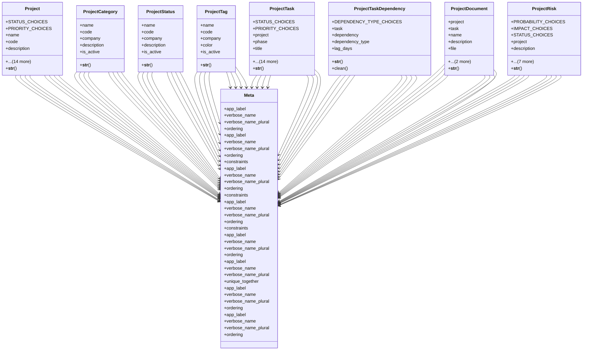

# services_modules.projects.models.project

## Imports
- core_modules.organization.models
- django.contrib.auth
- django.core.exceptions
- django.db
- django.utils.translation

## Classes
- Project
  - attr: `STATUS_CHOICES`
  - attr: `PRIORITY_CHOICES`
  - attr: `name`
  - attr: `code`
  - attr: `description`
  - attr: `start_date`
  - attr: `end_date`
  - attr: `actual_start_date`
  - attr: `actual_end_date`
  - attr: `status`
  - attr: `priority`
  - attr: `budget`
  - attr: `owner`
  - attr: `company`
  - attr: `currency`
  - attr: `workflow`
  - attr: `workflow_step`
  - attr: `created_at`
  - attr: `updated_at`
  - method: `__str__`
- ProjectCategory
  - attr: `name`
  - attr: `code`
  - attr: `company`
  - attr: `description`
  - attr: `is_active`
  - method: `__str__`
- ProjectStatus
  - attr: `name`
  - attr: `code`
  - attr: `company`
  - attr: `description`
  - attr: `is_active`
  - method: `__str__`
- ProjectTag
  - attr: `name`
  - attr: `code`
  - attr: `company`
  - attr: `color`
  - attr: `is_active`
  - method: `__str__`
- ProjectTask
  - attr: `STATUS_CHOICES`
  - attr: `PRIORITY_CHOICES`
  - attr: `project`
  - attr: `phase`
  - attr: `title`
  - attr: `description`
  - attr: `status`
  - attr: `priority`
  - attr: `assignee`
  - attr: `reporter`
  - attr: `due_date`
  - attr: `estimated_hours`
  - attr: `actual_hours`
  - attr: `start_date`
  - attr: `end_date`
  - attr: `parent_task`
  - attr: `created_at`
  - attr: `updated_at`
  - attr: `task`
  - method: `__str__`
- ProjectTaskDependency
  - attr: `DEPENDENCY_TYPE_CHOICES`
  - attr: `task`
  - attr: `dependency`
  - attr: `dependency_type`
  - attr: `lag_days`
  - method: `__str__`
  - method: `clean`
- ProjectDocument
  - attr: `project`
  - attr: `task`
  - attr: `name`
  - attr: `description`
  - attr: `file`
  - attr: `uploaded_by`
  - attr: `uploaded_at`
  - method: `__str__`
- ProjectRisk
  - attr: `PROBABILITY_CHOICES`
  - attr: `IMPACT_CHOICES`
  - attr: `STATUS_CHOICES`
  - attr: `project`
  - attr: `description`
  - attr: `probability`
  - attr: `impact`
  - attr: `status`
  - attr: `mitigation_plan`
  - attr: `owner`
  - attr: `identified_date`
  - attr: `resolution_date`
  - method: `__str__`
- Meta
  - attr: `app_label`
  - attr: `verbose_name`
  - attr: `verbose_name_plural`
  - attr: `ordering`
- Meta
  - attr: `app_label`
  - attr: `verbose_name`
  - attr: `verbose_name_plural`
  - attr: `ordering`
  - attr: `constraints`
- Meta
  - attr: `app_label`
  - attr: `verbose_name`
  - attr: `verbose_name_plural`
  - attr: `ordering`
  - attr: `constraints`
- Meta
  - attr: `app_label`
  - attr: `verbose_name`
  - attr: `verbose_name_plural`
  - attr: `ordering`
  - attr: `constraints`
- Meta
  - attr: `app_label`
  - attr: `verbose_name`
  - attr: `verbose_name_plural`
  - attr: `ordering`
- Meta
  - attr: `app_label`
  - attr: `verbose_name`
  - attr: `verbose_name_plural`
  - attr: `unique_together`
- Meta
  - attr: `app_label`
  - attr: `verbose_name`
  - attr: `verbose_name_plural`
  - attr: `ordering`
- Meta
  - attr: `app_label`
  - attr: `verbose_name`
  - attr: `verbose_name_plural`
  - attr: `ordering`

## Functions
- __str__
- __str__
- __str__
- __str__
- __str__
- __str__
- clean
- __str__
- __str__

## Module Variables
- `User`

## Class Diagram

