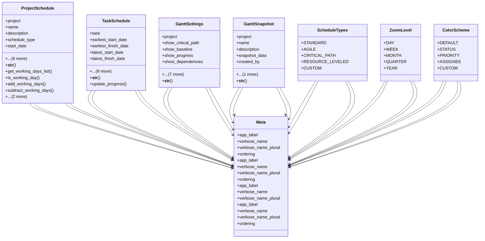

# services_modules.projects.models.project_gantt

## Imports
- datetime
- dependencies
- django.contrib.auth
- django.db
- django.utils
- django.utils.translation
- networkx
- project
- services_modules.tasks.models.task

## Classes
- ProjectSchedule
  - attr: `project`
  - attr: `name`
  - attr: `description`
  - attr: `schedule_type`
  - attr: `start_date`
  - attr: `end_date`
  - attr: `working_days`
  - attr: `working_hours_per_day`
  - attr: `created_by`
  - attr: `created_at`
  - attr: `updated_at`
  - method: `__str__`
  - method: `get_working_days_list`
  - method: `is_working_day`
  - method: `add_working_days`
  - method: `subtract_working_days`
  - method: `get_working_days_between`
  - method: `calculate_critical_path`
- TaskSchedule
  - attr: `task`
  - attr: `earliest_start_date`
  - attr: `earliest_finish_date`
  - attr: `latest_start_date`
  - attr: `latest_finish_date`
  - attr: `actual_start_date`
  - attr: `actual_finish_date`
  - attr: `baseline_start_date`
  - attr: `baseline_finish_date`
  - attr: `slack`
  - attr: `is_critical`
  - attr: `progress_percentage`
  - attr: `created_at`
  - attr: `updated_at`
  - method: `__str__`
  - method: `update_progress`
- GanttSettings
  - attr: `project`
  - attr: `show_critical_path`
  - attr: `show_baseline`
  - attr: `show_progress`
  - attr: `show_dependencies`
  - attr: `show_resources`
  - attr: `show_milestones`
  - attr: `zoom_level`
  - attr: `color_scheme`
  - attr: `custom_settings`
  - attr: `created_at`
  - attr: `updated_at`
  - method: `__str__`
- GanttSnapshot
  - attr: `project`
  - attr: `name`
  - attr: `description`
  - attr: `snapshot_data`
  - attr: `created_by`
  - attr: `created_at`
  - method: `__str__`
- ScheduleTypes
  - attr: `STANDARD`
  - attr: `AGILE`
  - attr: `CRITICAL_PATH`
  - attr: `RESOURCE_LEVELED`
  - attr: `CUSTOM`
- Meta
  - attr: `app_label`
  - attr: `verbose_name`
  - attr: `verbose_name_plural`
  - attr: `ordering`
- Meta
  - attr: `app_label`
  - attr: `verbose_name`
  - attr: `verbose_name_plural`
  - attr: `ordering`
- ZoomLevel
  - attr: `DAY`
  - attr: `WEEK`
  - attr: `MONTH`
  - attr: `QUARTER`
  - attr: `YEAR`
- ColorScheme
  - attr: `DEFAULT`
  - attr: `STATUS`
  - attr: `PRIORITY`
  - attr: `ASSIGNEE`
  - attr: `CUSTOM`
- Meta
  - attr: `app_label`
  - attr: `verbose_name`
  - attr: `verbose_name_plural`
- Meta
  - attr: `app_label`
  - attr: `verbose_name`
  - attr: `verbose_name_plural`
  - attr: `ordering`

## Functions
- __str__
- get_working_days_list
- is_working_day
- add_working_days
- subtract_working_days
- get_working_days_between
- calculate_critical_path
- __str__
- update_progress
- __str__
- __str__

## Module Variables
- `User`
- `__all__`

## Class Diagram

