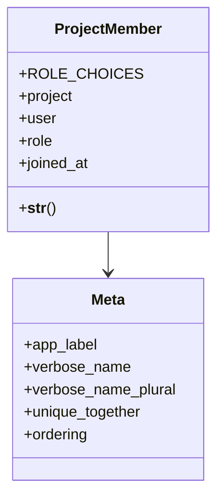

# services_modules.projects.models.project_member

## Imports
- django.contrib.auth
- django.db
- django.utils.translation
- project

## Classes
- ProjectMember
  - attr: `ROLE_CHOICES`
  - attr: `project`
  - attr: `user`
  - attr: `role`
  - attr: `joined_at`
  - method: `__str__`
- Meta
  - attr: `app_label`
  - attr: `verbose_name`
  - attr: `verbose_name_plural`
  - attr: `unique_together`
  - attr: `ordering`

## Functions
- __str__

## Module Variables
- `User`

## Class Diagram

