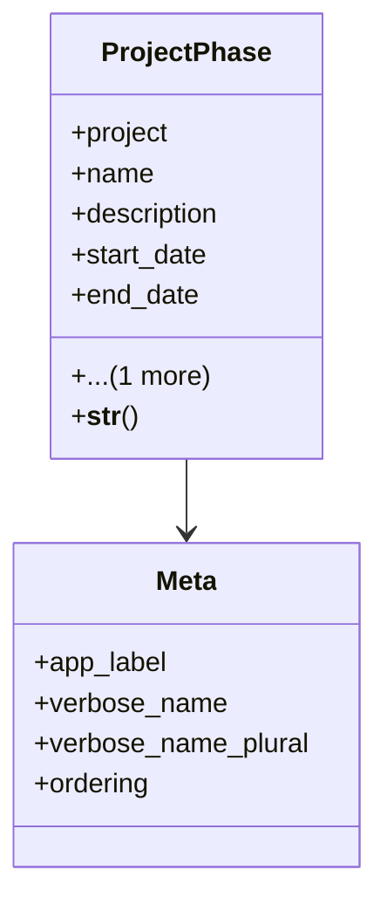

# services_modules.projects.models.project_phase

## Imports
- django.db
- django.utils.translation
- project

## Classes
- ProjectPhase
  - attr: `project`
  - attr: `name`
  - attr: `description`
  - attr: `start_date`
  - attr: `end_date`
  - attr: `order`
  - method: `__str__`
- Meta
  - attr: `app_label`
  - attr: `verbose_name`
  - attr: `verbose_name_plural`
  - attr: `ordering`

## Functions
- __str__

## Class Diagram

