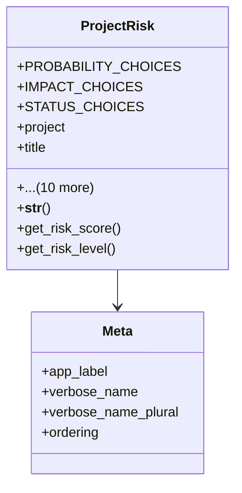

# services_modules.projects.models.project_risk

## Imports
- django.contrib.auth
- django.db
- django.utils.translation
- project

## Classes
- ProjectRisk
  - attr: `PROBABILITY_CHOICES`
  - attr: `IMPACT_CHOICES`
  - attr: `STATUS_CHOICES`
  - attr: `project`
  - attr: `title`
  - attr: `description`
  - attr: `probability`
  - attr: `impact`
  - attr: `status`
  - attr: `mitigation_plan`
  - attr: `owner`
  - attr: `identified_date`
  - attr: `resolution_date`
  - attr: `created_at`
  - attr: `updated_at`
  - method: `__str__`
  - method: `get_risk_score`
  - method: `get_risk_level`
- Meta
  - attr: `app_label`
  - attr: `verbose_name`
  - attr: `verbose_name_plural`
  - attr: `ordering`

## Functions
- __str__
- get_risk_score
- get_risk_level

## Module Variables
- `User`

## Class Diagram

