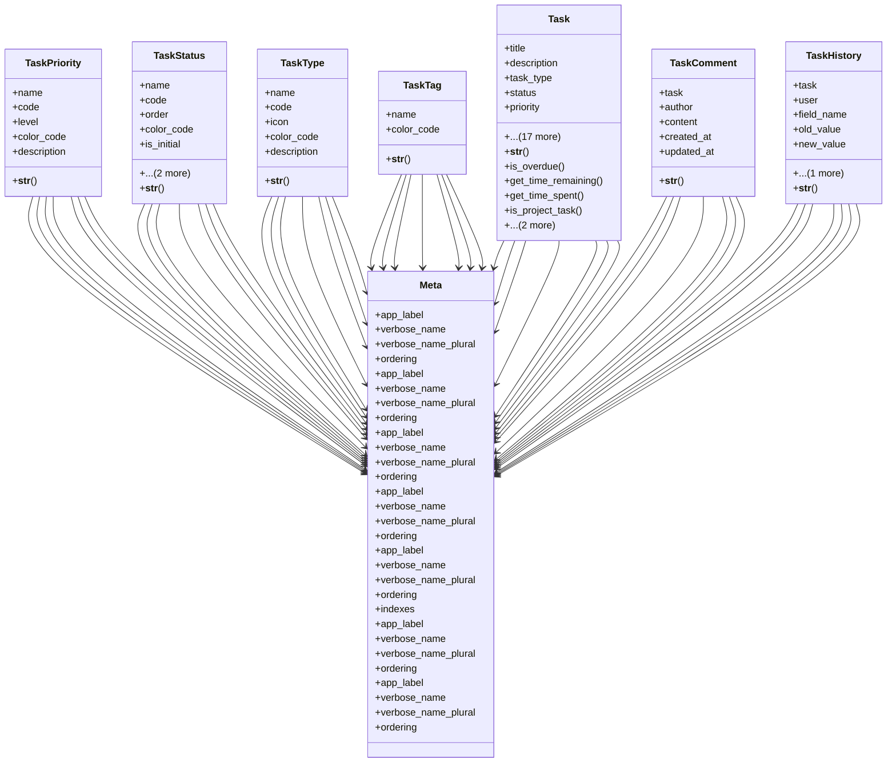

# services_modules.projects.models.task

## Imports
- django.contrib.auth
- django.contrib.contenttypes.fields
- django.contrib.contenttypes.models
- django.core.validators
- django.db
- django.utils
- django.utils.translation

## Classes
- TaskPriority
  - attr: `name`
  - attr: `code`
  - attr: `level`
  - attr: `color_code`
  - attr: `description`
  - method: `__str__`
- TaskStatus
  - attr: `name`
  - attr: `code`
  - attr: `order`
  - attr: `color_code`
  - attr: `is_initial`
  - attr: `is_final`
  - attr: `description`
  - method: `__str__`
- TaskType
  - attr: `name`
  - attr: `code`
  - attr: `icon`
  - attr: `color_code`
  - attr: `description`
  - method: `__str__`
- TaskTag
  - attr: `name`
  - attr: `color_code`
  - method: `__str__`
- Task
  - attr: `title`
  - attr: `description`
  - attr: `task_type`
  - attr: `status`
  - attr: `priority`
  - attr: `assignee`
  - attr: `reporter`
  - attr: `tags`
  - attr: `start_date`
  - attr: `due_date`
  - attr: `estimated_hours`
  - attr: `actual_hours`
  - attr: `completion_percentage`
  - attr: `parent_task`
  - attr: `content_type`
  - attr: `object_id`
  - attr: `content_object`
  - attr: `risks`
  - attr: `created_at`
  - attr: `workflow`
  - attr: `workflow_step`
  - attr: `updated_at`
  - method: `__str__`
  - method: `is_overdue`
  - method: `get_time_remaining`
  - method: `get_time_spent`
  - method: `is_project_task`
  - method: `has_subtasks`
  - method: `get_subtasks_count`
- TaskComment
  - attr: `task`
  - attr: `author`
  - attr: `content`
  - attr: `created_at`
  - attr: `updated_at`
  - method: `__str__`
- TaskHistory
  - attr: `task`
  - attr: `user`
  - attr: `field_name`
  - attr: `old_value`
  - attr: `new_value`
  - attr: `change_date`
  - method: `__str__`
- Meta
  - attr: `app_label`
  - attr: `verbose_name`
  - attr: `verbose_name_plural`
  - attr: `ordering`
- Meta
  - attr: `app_label`
  - attr: `verbose_name`
  - attr: `verbose_name_plural`
  - attr: `ordering`
- Meta
  - attr: `app_label`
  - attr: `verbose_name`
  - attr: `verbose_name_plural`
  - attr: `ordering`
- Meta
  - attr: `app_label`
  - attr: `verbose_name`
  - attr: `verbose_name_plural`
  - attr: `ordering`
- Meta
  - attr: `app_label`
  - attr: `verbose_name`
  - attr: `verbose_name_plural`
  - attr: `ordering`
  - attr: `indexes`
- Meta
  - attr: `app_label`
  - attr: `verbose_name`
  - attr: `verbose_name_plural`
  - attr: `ordering`
- Meta
  - attr: `app_label`
  - attr: `verbose_name`
  - attr: `verbose_name_plural`
  - attr: `ordering`

## Functions
- __str__
- __str__
- __str__
- __str__
- __str__
- is_overdue
- get_time_remaining
- get_time_spent
- is_project_task
- has_subtasks
- get_subtasks_count
- __str__
- __str__

## Module Variables
- `User`

## Class Diagram

