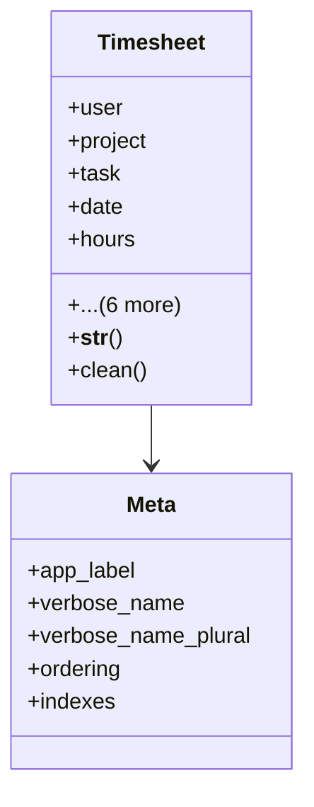

# services_modules.projects.models.timesheet

## Imports
- __future__
- core_modules.organization.models
- django.contrib.auth
- django.db
- django.utils.translation
- project
- task

## Classes
- Timesheet
  - attr: `user`
  - attr: `project`
  - attr: `task`
  - attr: `date`
  - attr: `hours`
  - attr: `description`
  - attr: `company`
  - attr: `branch`
  - attr: `created_by`
  - attr: `created_at`
  - attr: `updated_at`
  - method: `__str__`
  - method: `clean`
- Meta
  - attr: `app_label`
  - attr: `verbose_name`
  - attr: `verbose_name_plural`
  - attr: `ordering`
  - attr: `indexes`

## Functions
- __str__
- clean

## Module Variables
- `User`

## Class Diagram

