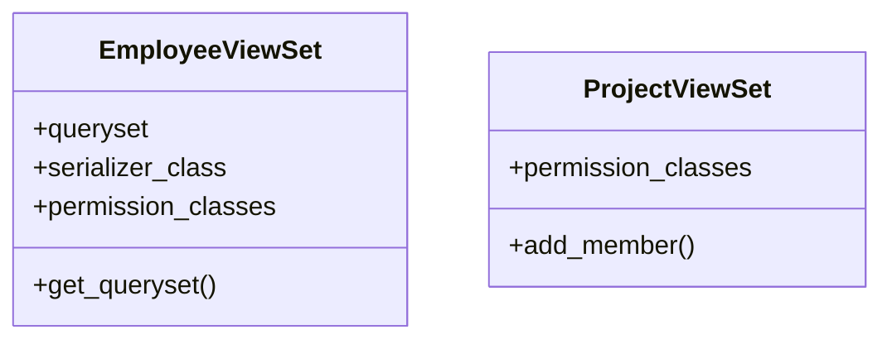

# services_modules.projects.models.views

## Imports
- django.db
- permissions.drf_permissions
- permissions.services
- rest_framework

## Classes
- EmployeeViewSet
  - attr: `queryset`
  - attr: `serializer_class`
  - attr: `permission_classes`
  - method: `get_queryset`
- ProjectViewSet
  - attr: `permission_classes`
  - method: `add_member`

## Functions
- get_queryset
- add_member

## Class Diagram

