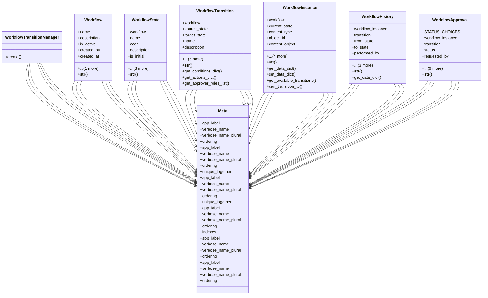

# services_modules.projects.models.workflow

## Imports
- django.contrib.auth
- django.contrib.contenttypes.fields
- django.contrib.contenttypes.models
- django.db
- django.utils.translation
- json

## Classes
- WorkflowTransitionManager
  - method: `create`
- Workflow
  - attr: `name`
  - attr: `description`
  - attr: `is_active`
  - attr: `created_by`
  - attr: `created_at`
  - attr: `updated_at`
  - method: `__str__`
- WorkflowState
  - attr: `workflow`
  - attr: `name`
  - attr: `code`
  - attr: `description`
  - attr: `is_initial`
  - attr: `is_final`
  - attr: `order`
  - attr: `color_code`
  - method: `__str__`
- WorkflowTransition
  - attr: `workflow`
  - attr: `source_state`
  - attr: `target_state`
  - attr: `name`
  - attr: `description`
  - attr: `conditions`
  - attr: `actions`
  - attr: `requires_approval`
  - attr: `approver_roles`
  - attr: `objects`
  - method: `__str__`
  - method: `get_conditions_dict`
  - method: `get_actions_dict`
  - method: `get_approver_roles_list`
- WorkflowInstance
  - attr: `workflow`
  - attr: `current_state`
  - attr: `content_type`
  - attr: `object_id`
  - attr: `content_object`
  - attr: `data`
  - attr: `created_by`
  - attr: `created_at`
  - attr: `updated_at`
  - method: `__str__`
  - method: `get_data_dict`
  - method: `set_data_dict`
  - method: `get_available_transitions`
  - method: `can_transition_to`
- WorkflowHistory
  - attr: `workflow_instance`
  - attr: `transition`
  - attr: `from_state`
  - attr: `to_state`
  - attr: `performed_by`
  - attr: `performed_at`
  - attr: `comments`
  - attr: `data`
  - method: `__str__`
  - method: `get_data_dict`
- WorkflowApproval
  - attr: `STATUS_CHOICES`
  - attr: `workflow_instance`
  - attr: `transition`
  - attr: `status`
  - attr: `requested_by`
  - attr: `requested_at`
  - attr: `approved_by`
  - attr: `approved_at`
  - attr: `rejected_by`
  - attr: `rejected_at`
  - attr: `comments`
  - method: `__str__`
- Meta
  - attr: `app_label`
  - attr: `verbose_name`
  - attr: `verbose_name_plural`
  - attr: `ordering`
- Meta
  - attr: `app_label`
  - attr: `verbose_name`
  - attr: `verbose_name_plural`
  - attr: `ordering`
  - attr: `unique_together`
- Meta
  - attr: `app_label`
  - attr: `verbose_name`
  - attr: `verbose_name_plural`
  - attr: `ordering`
  - attr: `unique_together`
- Meta
  - attr: `app_label`
  - attr: `verbose_name`
  - attr: `verbose_name_plural`
  - attr: `ordering`
  - attr: `indexes`
- Meta
  - attr: `app_label`
  - attr: `verbose_name`
  - attr: `verbose_name_plural`
  - attr: `ordering`
- Meta
  - attr: `app_label`
  - attr: `verbose_name`
  - attr: `verbose_name_plural`
  - attr: `ordering`

## Functions
- create
- __str__
- __str__
- __str__
- get_conditions_dict
- get_actions_dict
- get_approver_roles_list
- __str__
- get_data_dict
- set_data_dict
- get_available_transitions
- can_transition_to
- __str__
- get_data_dict
- __str__

## Module Variables
- `User`
- `WorkflowStep`

## Class Diagram

