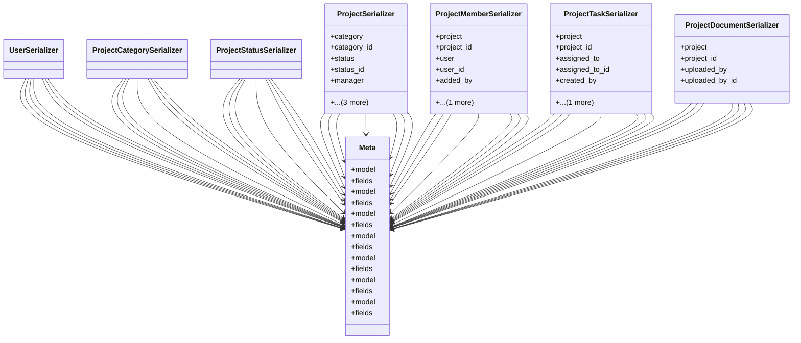

# services_modules.projects.serializers

## Imports
- django.contrib.auth.models
- django.db
- models
- rest_framework

## Classes
- UserSerializer
- ProjectCategorySerializer
- ProjectStatusSerializer
- ProjectSerializer
  - attr: `category`
  - attr: `category_id`
  - attr: `status`
  - attr: `status_id`
  - attr: `manager`
  - attr: `manager_id`
  - attr: `created_by`
  - attr: `created_by_id`
- ProjectMemberSerializer
  - attr: `project`
  - attr: `project_id`
  - attr: `user`
  - attr: `user_id`
  - attr: `added_by`
  - attr: `added_by_id`
- ProjectTaskSerializer
  - attr: `project`
  - attr: `project_id`
  - attr: `assigned_to`
  - attr: `assigned_to_id`
  - attr: `created_by`
  - attr: `created_by_id`
- ProjectDocumentSerializer
  - attr: `project`
  - attr: `project_id`
  - attr: `uploaded_by`
  - attr: `uploaded_by_id`
- Meta
  - attr: `model`
  - attr: `fields`
- Meta
  - attr: `model`
  - attr: `fields`
- Meta
  - attr: `model`
  - attr: `fields`
- Meta
  - attr: `model`
  - attr: `fields`
- Meta
  - attr: `model`
  - attr: `fields`
- Meta
  - attr: `model`
  - attr: `fields`
- Meta
  - attr: `model`
  - attr: `fields`

## Class Diagram

