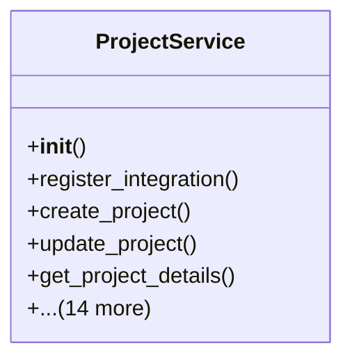

# services_modules.projects.services

## Imports
- datetime
- django.db
- django.db.models
- django.utils
- logging
- models

## Classes
- ProjectService
  - method: `__init__`
  - method: `register_integration`
  - method: `create_project`
  - method: `update_project`
  - method: `get_project_details`
  - method: `list_projects`
  - method: `update_project_status`
  - method: `create_project_phase`
  - method: `update_project_phase`
  - method: `create_project_task`
  - method: `update_project_task`
  - method: `create_project_risk`
  - method: `update_project_risk`
  - method: `create_project_document`
  - method: `update_project_document`
  - method: `get_project_statistics`
  - method: `generate_project_report`
  - method: `_create_default_project_phases`
  - method: `_calculate_project_progress`

## Functions
- __init__
- register_integration
- create_project
- update_project
- get_project_details
- list_projects
- update_project_status
- create_project_phase
- update_project_phase
- create_project_task
- update_project_task
- create_project_risk
- update_project_risk
- create_project_document
- update_project_document
- get_project_statistics
- generate_project_report
- _create_default_project_phases
- _calculate_project_progress

## Module Variables
- `logger`

## Class Diagram

