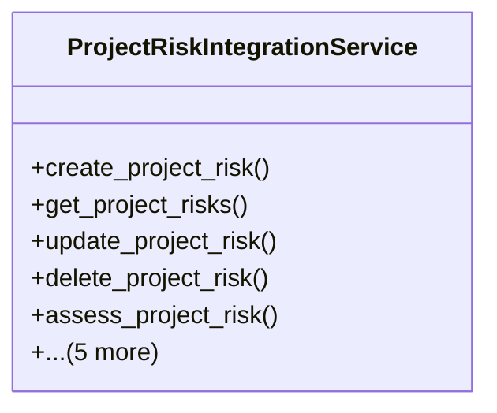

# services_modules.projects.services.project_risk_integration

## Imports
- django.contrib.contenttypes.models
- django.core.exceptions
- django.db
- django.utils
- models.permissions
- models.risk

## Classes
- ProjectRiskIntegrationService
  - method: `create_project_risk`
  - method: `get_project_risks`
  - method: `update_project_risk`
  - method: `delete_project_risk`
  - method: `assess_project_risk`
  - method: `create_risk_response`
  - method: `get_project_risks_by_level`
  - method: `get_project_risks_by_status`
  - method: `get_project_risks_by_category`
  - method: `get_project_risk_statistics`

## Functions
- create_project_risk
- get_project_risks
- update_project_risk
- delete_project_risk
- assess_project_risk
- create_risk_response
- get_project_risks_by_level
- get_project_risks_by_status
- get_project_risks_by_category
- get_project_risk_statistics

## Class Diagram

