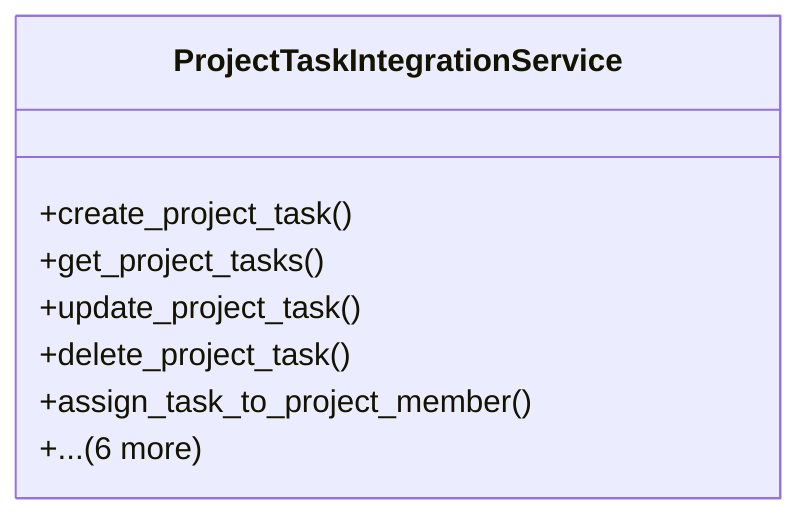

# services_modules.projects.services.project_task_integration

## Imports
- django.contrib.contenttypes.models
- django.core.exceptions
- django.db
- django.utils
- models.permissions
- models.task

## Classes
- ProjectTaskIntegrationService
  - method: `create_project_task`
  - method: `get_project_tasks`
  - method: `update_project_task`
  - method: `delete_project_task`
  - method: `assign_task_to_project_member`
  - method: `get_project_tasks_by_status`
  - method: `get_project_tasks_by_priority`
  - method: `get_project_tasks_by_assignee`
  - method: `get_project_overdue_tasks`
  - method: `get_project_completion_percentage`
  - method: `get_project_tasks_statistics`

## Functions
- create_project_task
- get_project_tasks
- update_project_task
- delete_project_task
- assign_task_to_project_member
- get_project_tasks_by_status
- get_project_tasks_by_priority
- get_project_tasks_by_assignee
- get_project_overdue_tasks
- get_project_completion_percentage
- get_project_tasks_statistics

## Class Diagram

