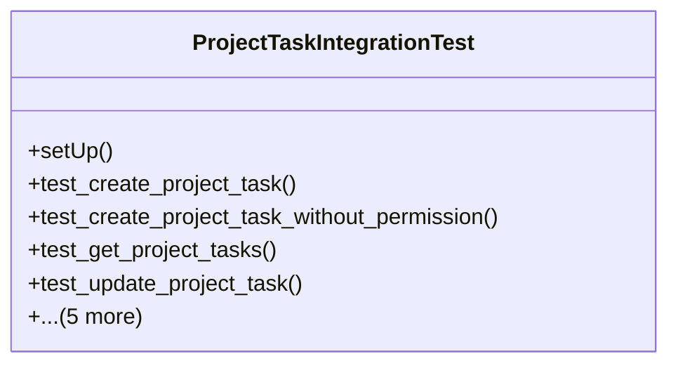

# services_modules.projects.tests.test_project_task_integration

## Imports
- datetime
- django.contrib.auth
- django.core.exceptions
- django.db
- django.test
- models.project
- models.task
- services.project_task_integration
- unittest
- unittest.mock

## Classes
- ProjectTaskIntegrationTest
  - method: `setUp`
  - method: `test_create_project_task`
  - method: `test_create_project_task_without_permission`
  - method: `test_get_project_tasks`
  - method: `test_update_project_task`
  - method: `test_delete_project_task`
  - method: `test_assign_task_to_project_member`
  - method: `test_get_project_tasks_statistics`
  - method: `test_get_project_overdue_tasks`
  - method: `test_get_project_completion_percentage`

## Functions
- setUp
- test_create_project_task
- test_create_project_task_without_permission
- test_get_project_tasks
- test_update_project_task
- test_delete_project_task
- test_assign_task_to_project_member
- test_get_project_tasks_statistics
- test_get_project_overdue_tasks
- test_get_project_completion_percentage

## Class Diagram

