# services_modules.projects.tests.test_projects

## Imports
- core_modules.organization.models
- datetime
- django.contrib.auth
- django.core.exceptions
- django.db
- django.test
- django.utils
- models.project
- models.task
- models.timesheet

## Classes
- ProjectCategoryModelTest
  - method: `setUp`
  - method: `test_create_project_category`
  - method: `test_unique_code_per_company`
- ProjectStatusModelTest
  - method: `setUp`
  - method: `test_create_project_status`
  - method: `test_unique_code_per_company`
- ProjectTagModelTest
  - method: `setUp`
  - method: `test_create_project_tag`
  - method: `test_unique_code_per_company`
- ProjectModelTest
  - method: `setUp`
  - method: `test_create_project`
  - method: `test_unique_code_per_company`
  - method: `test_add_tag_to_project`
  - method: `test_remove_tag_from_project`
  - method: `test_calculate_progress`
- TaskStatusModelTest
  - method: `setUp`
  - method: `test_create_task_status`
  - method: `test_unique_code_per_company`
- TaskPriorityModelTest
  - method: `setUp`
  - method: `test_create_task_priority`
  - method: `test_unique_code_per_company`
- TaskTagModelTest
  - method: `setUp`
  - method: `test_create_task_tag`
  - method: `test_unique_code_per_company`
- TaskModelTest
  - method: `setUp`
  - method: `test_create_task`
  - method: `test_add_tag_to_task`
  - method: `test_remove_tag_from_task`
  - method: `test_change_task_status`
- TimesheetModelTest
  - method: `setUp`
  - method: `test_create_timesheet`
  - method: `test_hours_validation`
  - method: `test_calculate_total_hours_for_task`

## Functions
- setUp
- test_create_project_category
- test_unique_code_per_company
- setUp
- test_create_project_status
- test_unique_code_per_company
- setUp
- test_create_project_tag
- test_unique_code_per_company
- setUp
- test_create_project
- test_unique_code_per_company
- test_add_tag_to_project
- test_remove_tag_from_project
- test_calculate_progress
- setUp
- test_create_task_status
- test_unique_code_per_company
- setUp
- test_create_task_priority
- test_unique_code_per_company
- setUp
- test_create_task_tag
- test_unique_code_per_company
- setUp
- test_create_task
- test_add_tag_to_task
- test_remove_tag_from_task
- test_change_task_status
- setUp
- test_create_timesheet
- test_hours_validation
- test_calculate_total_hours_for_task
- mock_calculate_progress
- mock_calculate_total_hours

## Module Variables
- `User`

## Class Diagram

```mermaid
classDiagram
    class ProjectCategoryModelTest {
        +setUp()
        +test_create_project_category()
        +test_unique_code_per_company()
    }
    class ProjectStatusModelTest {
        +setUp()
        +test_create_project_status()
        +test_unique_code_per_company()
    }
    class ProjectTagModelTest {
        +setUp()
        +test_create_project_tag()
        +test_unique_code_per_company()
    }
    class ProjectModelTest {
        +setUp()
        +test_create_project()
        +test_unique_code_per_company()
        +test_add_tag_to_project()
        +test_remove_tag_from_project()
        +... (1 more)
    }
    class TaskStatusModelTest {
        +setUp()
        +test_create_task_status()
        +test_unique_code_per_company()
    }
    class TaskPriorityModelTest {
        +setUp()
        +test_create_task_priority()
        +test_unique_code_per_company()
    }
    class TaskTagModelTest {
        +setUp()
        +test_create_task_tag()
        +test_unique_code_per_company()
    }
    class TaskModelTest {
        +setUp()
        +test_create_task()
        +test_add_tag_to_task()
        +test_remove_tag_from_task()
        +test_change_task_status()
    }
    class TimesheetModelTest {
        +setUp()
        +test_create_timesheet()
        +test_hours_validation()
        +test_calculate_total_hours_for_task()
    }
```

