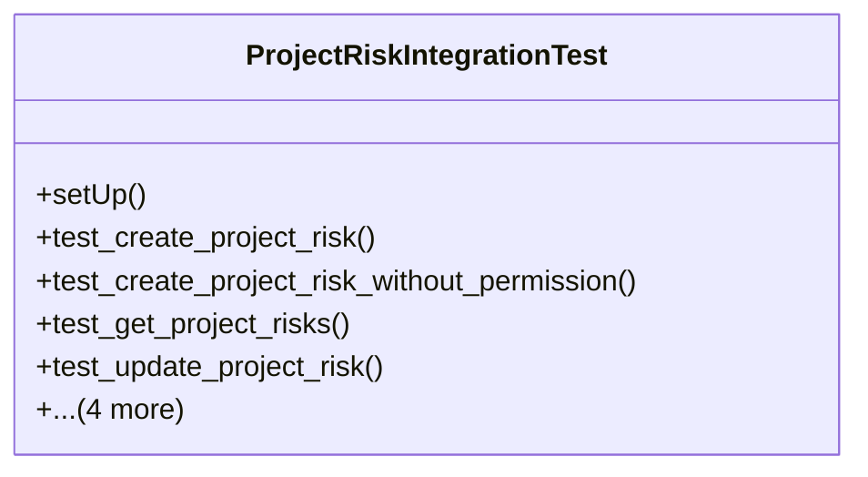

# services_modules.projects.tests.test_risk_management_integration

## Imports
- datetime
- django.contrib.auth
- django.core.exceptions
- django.db
- django.test
- models.project
- models.risk
- services.project_risk_integration
- unittest
- unittest.mock

## Classes
- ProjectRiskIntegrationTest
  - method: `setUp`
  - method: `test_create_project_risk`
  - method: `test_create_project_risk_without_permission`
  - method: `test_get_project_risks`
  - method: `test_update_project_risk`
  - method: `test_delete_project_risk`
  - method: `test_get_project_risk_statistics`
  - method: `test_get_project_high_risks`
  - method: `test_get_project_risk_mitigation_status`

## Functions
- setUp
- test_create_project_risk
- test_create_project_risk_without_permission
- test_get_project_risks
- test_update_project_risk
- test_delete_project_risk
- test_get_project_risk_statistics
- test_get_project_high_risks
- test_get_project_risk_mitigation_status

## Class Diagram

