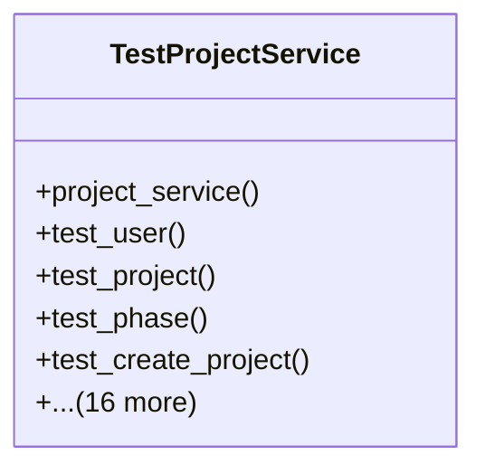

# services_modules.projects.tests.test_services

## Imports
- datetime
- django.contrib.auth
- django.test
- django.utils
- models
- pytest
- services

## Classes
- TestProjectService
  - method: `project_service`
  - method: `test_user`
  - method: `test_project`
  - method: `test_phase`
  - method: `test_create_project`
  - method: `test_update_project`
  - method: `test_get_project_details`
  - method: `test_list_projects`
  - method: `test_update_project_status`
  - method: `test_create_project_phase`
  - method: `test_update_project_phase`
  - method: `test_create_project_task`
  - method: `test_update_project_task`
  - method: `test_create_project_risk`
  - method: `test_update_project_risk`
  - method: `test_create_project_document`
  - method: `test_update_project_document`
  - method: `test_get_project_statistics`
  - method: `test_generate_project_report_summary`
  - method: `test_generate_project_report_detailed`
  - method: `test_generate_project_report_specific_project`

## Functions
- project_service
- test_user
- test_project
- test_phase
- test_create_project
- test_update_project
- test_get_project_details
- test_list_projects
- test_update_project_status
- test_create_project_phase
- test_update_project_phase
- test_create_project_task
- test_update_project_task
- test_create_project_risk
- test_update_project_risk
- test_create_project_document
- test_update_project_document
- test_get_project_statistics
- test_generate_project_report_summary
- test_generate_project_report_detailed
- test_generate_project_report_specific_project

## Module Variables
- `User`

## Class Diagram

