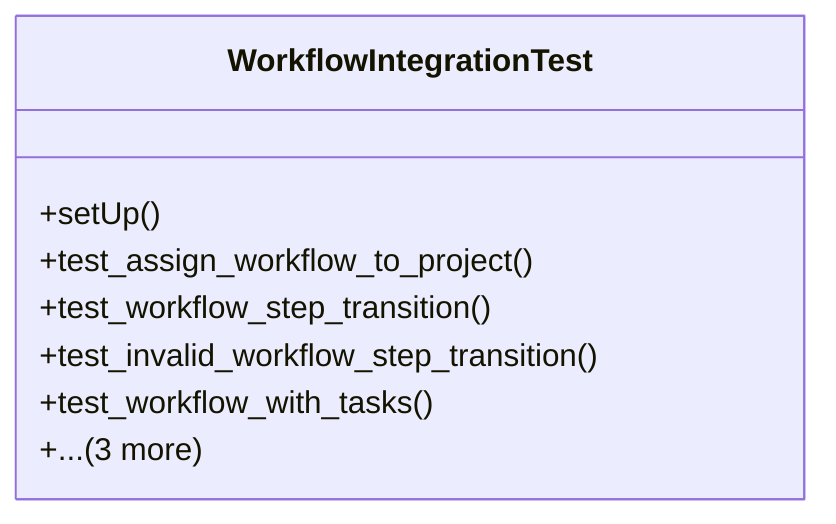

# services_modules.projects.tests.test_workflow_integration

## Imports
- datetime
- django.contrib.auth
- django.core.exceptions
- django.db
- django.test
- models.project
- models.task
- models.workflow
- unittest
- unittest.mock

## Classes
- WorkflowIntegrationTest
  - method: `setUp`
  - method: `test_assign_workflow_to_project`
  - method: `test_workflow_step_transition`
  - method: `test_invalid_workflow_step_transition`
  - method: `test_workflow_with_tasks`
  - method: `test_workflow_status_mapping`
  - method: `test_workflow_permissions`
  - method: `test_workflow_history`

## Functions
- setUp
- test_assign_workflow_to_project
- test_workflow_step_transition
- test_invalid_workflow_step_transition
- test_workflow_with_tasks
- test_workflow_status_mapping
- test_workflow_permissions
- test_workflow_history

## Class Diagram

