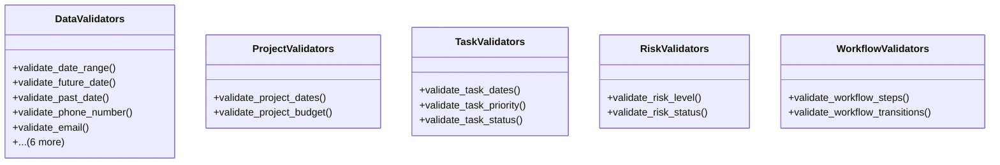

# services_modules.projects.utils.data_validators

## Imports
- datetime
- django.core.exceptions
- django.db
- django.utils.translation
- re

## Classes
- DataValidators
  - method: `validate_date_range`
  - method: `validate_future_date`
  - method: `validate_past_date`
  - method: `validate_phone_number`
  - method: `validate_email`
  - method: `validate_percentage`
  - method: `validate_positive_number`
  - method: `validate_text_length`
  - method: `validate_url`
  - method: `validate_alphanumeric`
  - method: `validate_password_strength`
- ProjectValidators
  - method: `validate_project_dates`
  - method: `validate_project_budget`
- TaskValidators
  - method: `validate_task_dates`
  - method: `validate_task_priority`
  - method: `validate_task_status`
- RiskValidators
  - method: `validate_risk_level`
  - method: `validate_risk_status`
- WorkflowValidators
  - method: `validate_workflow_steps`
  - method: `validate_workflow_transitions`

## Functions
- validate_date_range
- validate_future_date
- validate_past_date
- validate_phone_number
- validate_email
- validate_percentage
- validate_positive_number
- validate_text_length
- validate_url
- validate_alphanumeric
- validate_password_strength
- validate_project_dates
- validate_project_budget
- validate_task_dates
- validate_task_priority
- validate_task_status
- validate_risk_level
- validate_risk_status
- validate_workflow_steps
- validate_workflow_transitions

## Class Diagram

