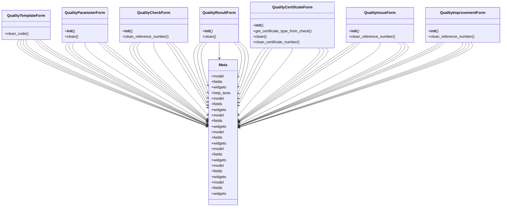

# services_modules.quality_control.forms

## Imports
- django
- django.core.exceptions
- django.utils
- django.utils.translation
- models

## Classes
- QualityTemplateForm
  - method: `clean_code`
- QualityParameterForm
  - method: `__init__`
  - method: `clean`
- QualityCheckForm
  - method: `__init__`
  - method: `clean_reference_number`
- QualityResultForm
  - method: `__init__`
  - method: `clean`
- QualityCertificateForm
  - method: `__init__`
  - method: `get_certificate_type_from_check`
  - method: `clean`
  - method: `clean_certificate_number`
- QualityIssueForm
  - method: `__init__`
  - method: `clean_reference_number`
- QualityImprovementForm
  - method: `__init__`
  - method: `clean_reference_number`
- Meta
  - attr: `model`
  - attr: `fields`
  - attr: `widgets`
  - attr: `help_texts`
- Meta
  - attr: `model`
  - attr: `fields`
  - attr: `widgets`
- Meta
  - attr: `model`
  - attr: `fields`
  - attr: `widgets`
- Meta
  - attr: `model`
  - attr: `fields`
  - attr: `widgets`
- Meta
  - attr: `model`
  - attr: `fields`
  - attr: `widgets`
- Meta
  - attr: `model`
  - attr: `fields`
  - attr: `widgets`
- Meta
  - attr: `model`
  - attr: `fields`
  - attr: `widgets`

## Functions
- clean_code
- __init__
- clean
- __init__
- clean_reference_number
- __init__
- clean
- __init__
- get_certificate_type_from_check
- clean
- clean_certificate_number
- __init__
- clean_reference_number
- __init__
- clean_reference_number

## Class Diagram

