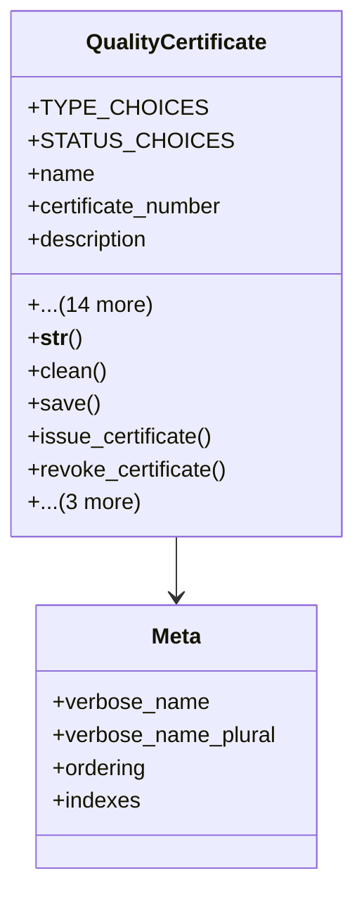

# services_modules.quality_control.models.quality_certificate

## Imports
- django.conf
- django.core.exceptions
- django.db
- django.utils
- django.utils.translation

## Classes
- QualityCertificate
  - attr: `TYPE_CHOICES`
  - attr: `STATUS_CHOICES`
  - attr: `name`
  - attr: `certificate_number`
  - attr: `description`
  - attr: `certificate_type`
  - attr: `status`
  - attr: `quality_check`
  - attr: `product`
  - attr: `issue_date`
  - attr: `expiry_date`
  - attr: `issuing_authority`
  - attr: `standards`
  - attr: `notes`
  - attr: `certificate_file`
  - attr: `created_at`
  - attr: `updated_at`
  - attr: `created_by`
  - attr: `issued_by`
  - method: `__str__`
  - method: `clean`
  - method: `save`
  - method: `issue_certificate`
  - method: `revoke_certificate`
  - method: `renew_certificate`
  - method: `is_valid`
  - method: `get_validity_days_remaining`
- Meta
  - attr: `verbose_name`
  - attr: `verbose_name_plural`
  - attr: `ordering`
  - attr: `indexes`

## Functions
- __str__
- clean
- save
- issue_certificate
- revoke_certificate
- renew_certificate
- is_valid
- get_validity_days_remaining

## Class Diagram

