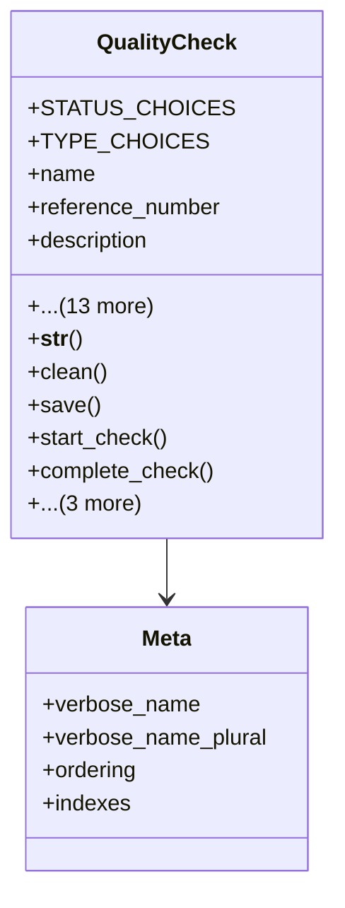

# services_modules.quality_control.models.quality_check

## Imports
- django.conf
- django.core.exceptions
- django.db
- django.utils
- django.utils.translation

## Classes
- QualityCheck
  - attr: `STATUS_CHOICES`
  - attr: `TYPE_CHOICES`
  - attr: `name`
  - attr: `reference_number`
  - attr: `description`
  - attr: `check_type`
  - attr: `status`
  - attr: `template`
  - attr: `product`
  - attr: `responsible_user`
  - attr: `scheduled_date`
  - attr: `start_date`
  - attr: `end_date`
  - attr: `notes`
  - attr: `is_critical`
  - attr: `created_at`
  - attr: `updated_at`
  - attr: `created_by`
  - method: `__str__`
  - method: `clean`
  - method: `save`
  - method: `start_check`
  - method: `complete_check`
  - method: `cancel_check`
  - method: `get_duration`
  - method: `get_results_summary`
- Meta
  - attr: `verbose_name`
  - attr: `verbose_name_plural`
  - attr: `ordering`
  - attr: `indexes`

## Functions
- __str__
- clean
- save
- start_check
- complete_check
- cancel_check
- get_duration
- get_results_summary

## Class Diagram

