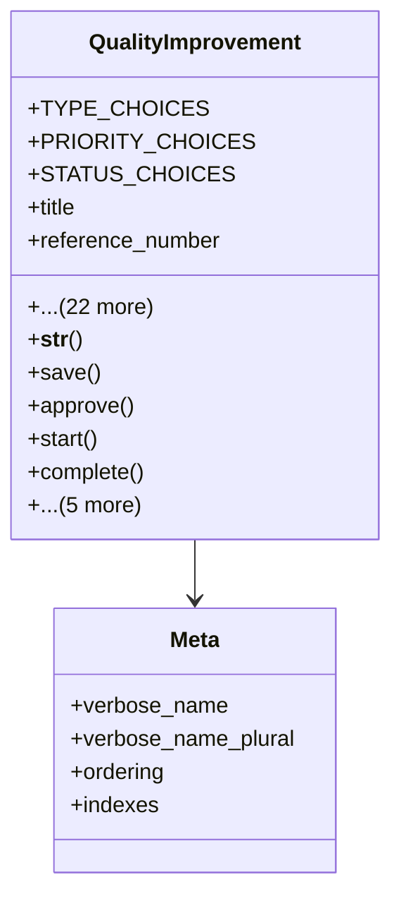

# services_modules.quality_control.models.quality_improvement

## Imports
- django.conf
- django.db
- django.utils
- django.utils.translation

## Classes
- QualityImprovement
  - attr: `TYPE_CHOICES`
  - attr: `PRIORITY_CHOICES`
  - attr: `STATUS_CHOICES`
  - attr: `title`
  - attr: `reference_number`
  - attr: `description`
  - attr: `improvement_type`
  - attr: `priority`
  - attr: `status`
  - attr: `related_issue`
  - attr: `product`
  - attr: `implementation_plan`
  - attr: `expected_benefits`
  - attr: `resources_required`
  - attr: `success_criteria`
  - attr: `proposed_date`
  - attr: `approval_date`
  - attr: `start_date`
  - attr: `completion_date`
  - attr: `target_completion_date`
  - attr: `notes`
  - attr: `attachments`
  - attr: `created_at`
  - attr: `updated_at`
  - attr: `created_by`
  - attr: `approved_by`
  - attr: `assigned_to`
  - method: `__str__`
  - method: `save`
  - method: `approve`
  - method: `start`
  - method: `complete`
  - method: `cancel`
  - method: `is_overdue`
  - method: `get_progress_percentage`
  - method: `get_duration`
  - method: `get_related_documents`
- Meta
  - attr: `verbose_name`
  - attr: `verbose_name_plural`
  - attr: `ordering`
  - attr: `indexes`

## Functions
- __str__
- save
- approve
- start
- complete
- cancel
- is_overdue
- get_progress_percentage
- get_duration
- get_related_documents

## Class Diagram

