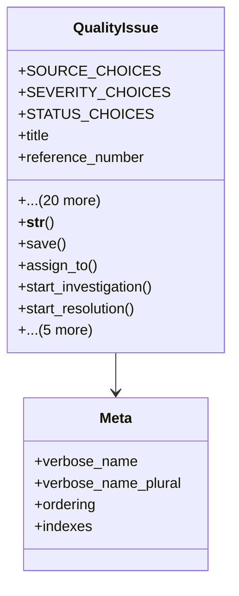

# services_modules.quality_control.models.quality_issue

## Imports
- django.conf
- django.db
- django.utils
- django.utils.translation
- quality_improvement

## Classes
- QualityIssue
  - attr: `SOURCE_CHOICES`
  - attr: `SEVERITY_CHOICES`
  - attr: `STATUS_CHOICES`
  - attr: `title`
  - attr: `reference_number`
  - attr: `description`
  - attr: `source`
  - attr: `severity`
  - attr: `status`
  - attr: `quality_check`
  - attr: `product`
  - attr: `root_cause`
  - attr: `corrective_action`
  - attr: `preventive_action`
  - attr: `reported_date`
  - attr: `investigation_date`
  - attr: `resolution_date`
  - attr: `closure_date`
  - attr: `notes`
  - attr: `attachments`
  - attr: `created_at`
  - attr: `updated_at`
  - attr: `reported_by`
  - attr: `assigned_to`
  - attr: `resolved_by`
  - method: `__str__`
  - method: `save`
  - method: `assign_to`
  - method: `start_investigation`
  - method: `start_resolution`
  - method: `resolve`
  - method: `close`
  - method: `reopen`
  - method: `get_resolution_time`
  - method: `create_improvement`
- Meta
  - attr: `verbose_name`
  - attr: `verbose_name_plural`
  - attr: `ordering`
  - attr: `indexes`

## Functions
- __str__
- save
- assign_to
- start_investigation
- start_resolution
- resolve
- close
- reopen
- get_resolution_time
- create_improvement

## Class Diagram

