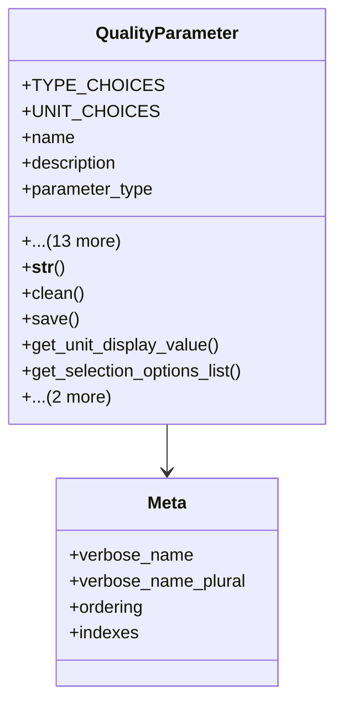

# services_modules.quality_control.models.quality_parameter

## Imports
- django.core.exceptions
- django.db
- django.utils.translation

## Classes
- QualityParameter
  - attr: `TYPE_CHOICES`
  - attr: `UNIT_CHOICES`
  - attr: `name`
  - attr: `description`
  - attr: `parameter_type`
  - attr: `template`
  - attr: `test_method`
  - attr: `expected_value`
  - attr: `min_value`
  - attr: `max_value`
  - attr: `unit`
  - attr: `custom_unit`
  - attr: `selection_options`
  - attr: `sequence`
  - attr: `is_critical`
  - attr: `is_active`
  - attr: `created_at`
  - attr: `updated_at`
  - method: `__str__`
  - method: `clean`
  - method: `save`
  - method: `get_unit_display_value`
  - method: `get_selection_options_list`
  - method: `is_value_within_range`
  - method: `is_valid_selection`
- Meta
  - attr: `verbose_name`
  - attr: `verbose_name_plural`
  - attr: `ordering`
  - attr: `indexes`

## Functions
- __str__
- clean
- save
- get_unit_display_value
- get_selection_options_list
- is_value_within_range
- is_valid_selection

## Class Diagram

