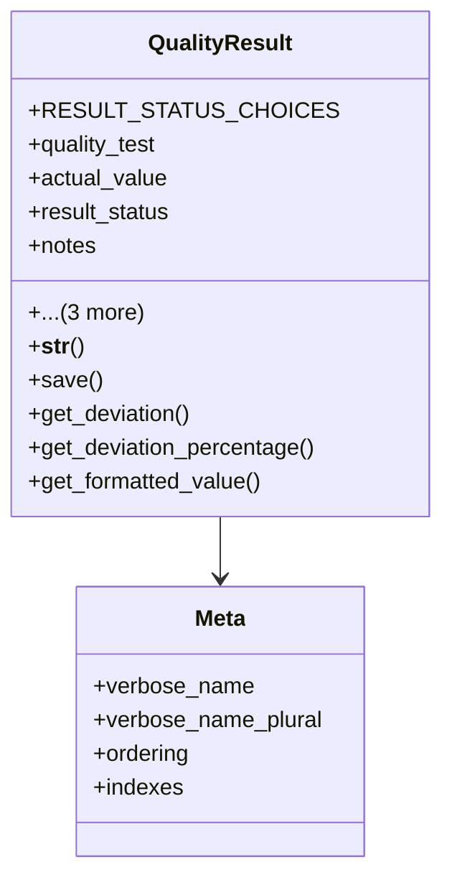

# services_modules.quality_control.models.quality_result

## Imports
- django.conf
- django.db
- django.utils.translation

## Classes
- QualityResult
  - attr: `RESULT_STATUS_CHOICES`
  - attr: `quality_test`
  - attr: `actual_value`
  - attr: `result_status`
  - attr: `notes`
  - attr: `evidence`
  - attr: `created_at`
  - attr: `created_by`
  - method: `__str__`
  - method: `save`
  - method: `get_deviation`
  - method: `get_deviation_percentage`
  - method: `get_formatted_value`
- Meta
  - attr: `verbose_name`
  - attr: `verbose_name_plural`
  - attr: `ordering`
  - attr: `indexes`

## Functions
- __str__
- save
- get_deviation
- get_deviation_percentage
- get_formatted_value

## Class Diagram

