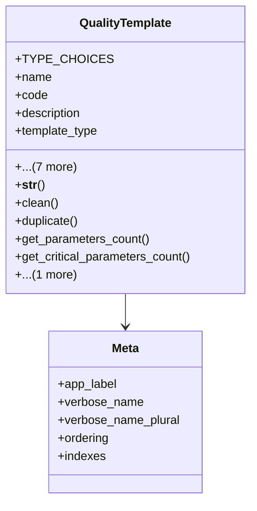

# services_modules.quality_control.models.quality_template

## Imports
- django.conf
- django.core.exceptions
- django.db
- django.utils
- django.utils.translation
- quality_check
- quality_test

## Classes
- QualityTemplate
  - attr: `TYPE_CHOICES`
  - attr: `name`
  - attr: `code`
  - attr: `description`
  - attr: `template_type`
  - attr: `is_active`
  - attr: `product_category`
  - attr: `version`
  - attr: `notes`
  - attr: `created_at`
  - attr: `updated_at`
  - attr: `created_by`
  - method: `__str__`
  - method: `clean`
  - method: `duplicate`
  - method: `get_parameters_count`
  - method: `get_critical_parameters_count`
  - method: `create_check`
- Meta
  - attr: `app_label`
  - attr: `verbose_name`
  - attr: `verbose_name_plural`
  - attr: `ordering`
  - attr: `indexes`

## Functions
- __str__
- clean
- duplicate
- get_parameters_count
- get_critical_parameters_count
- create_check

## Class Diagram

