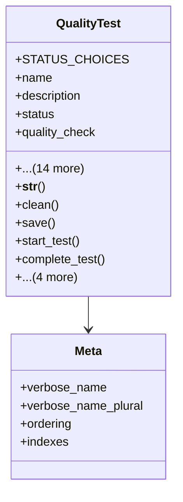

# services_modules.quality_control.models.quality_test

## Imports
- django.core.exceptions
- django.db
- django.utils
- django.utils.translation
- quality_result

## Classes
- QualityTest
  - attr: `STATUS_CHOICES`
  - attr: `name`
  - attr: `description`
  - attr: `status`
  - attr: `quality_check`
  - attr: `parameter`
  - attr: `test_method`
  - attr: `expected_value`
  - attr: `min_value`
  - attr: `max_value`
  - attr: `unit`
  - attr: `sequence`
  - attr: `is_critical`
  - attr: `notes`
  - attr: `scheduled_date`
  - attr: `start_date`
  - attr: `end_date`
  - attr: `created_at`
  - attr: `updated_at`
  - method: `__str__`
  - method: `clean`
  - method: `save`
  - method: `start_test`
  - method: `complete_test`
  - method: `skip_test`
  - method: `get_duration`
  - method: `is_value_acceptable`
  - method: `get_latest_result`
- Meta
  - attr: `verbose_name`
  - attr: `verbose_name_plural`
  - attr: `ordering`
  - attr: `indexes`

## Functions
- __str__
- clean
- save
- start_test
- complete_test
- skip_test
- get_duration
- is_value_acceptable
- get_latest_result

## Class Diagram

