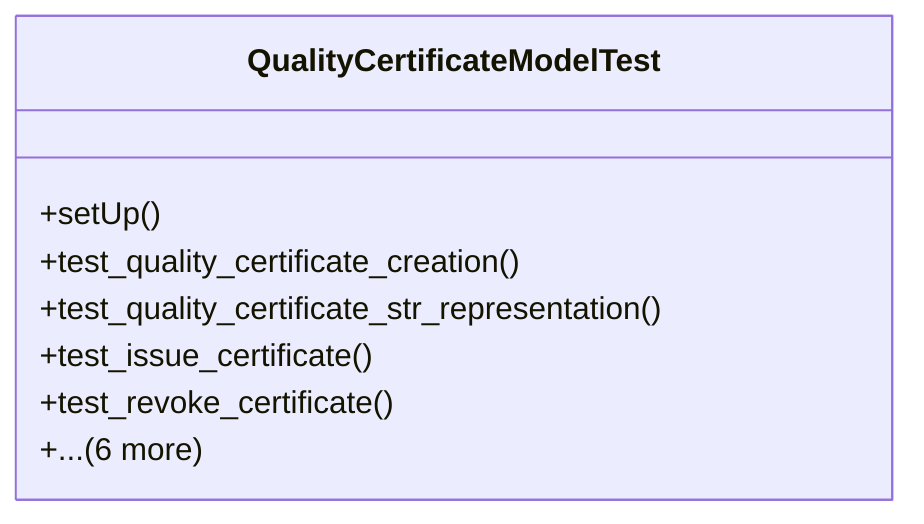

# services_modules.quality_control.tests.test_quality_certificate

## Imports
- datetime
- django
- django.contrib.auth
- django.core.exceptions
- django.test
- django.utils
- os
- services_modules.quality_control.models.quality_certificate
- services_modules.quality_control.models.quality_check
- services_modules.quality_control.models.quality_template

## Classes
- QualityCertificateModelTest
  - method: `setUp`
  - method: `test_quality_certificate_creation`
  - method: `test_quality_certificate_str_representation`
  - method: `test_issue_certificate`
  - method: `test_revoke_certificate`
  - method: `test_cannot_revoke_draft_certificate`
  - method: `test_renew_certificate`
  - method: `test_validation_expiry_date_before_issue_date`
  - method: `test_validation_issued_without_issue_date`
  - method: `test_is_valid`
  - method: `test_get_validity_days_remaining`

## Functions
- setUp
- test_quality_certificate_creation
- test_quality_certificate_str_representation
- test_issue_certificate
- test_revoke_certificate
- test_cannot_revoke_draft_certificate
- test_renew_certificate
- test_validation_expiry_date_before_issue_date
- test_validation_issued_without_issue_date
- test_is_valid
- test_get_validity_days_remaining

## Module Variables
- `User`

## Class Diagram

