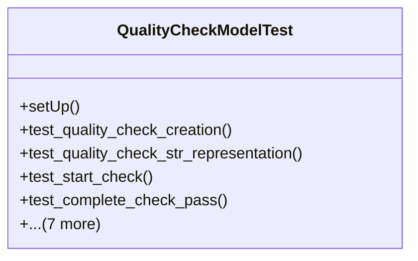

# services_modules.quality_control.tests.test_quality_check

## Imports
- django.contrib.auth
- django.core.exceptions
- django.db
- django.test
- django.utils
- models.quality_check
- models.quality_template

## Classes
- QualityCheckModelTest
  - method: `setUp`
  - method: `test_quality_check_creation`
  - method: `test_quality_check_str_representation`
  - method: `test_start_check`
  - method: `test_complete_check_pass`
  - method: `test_complete_check_fail`
  - method: `test_cancel_check`
  - method: `test_cannot_cancel_completed_check`
  - method: `test_get_duration`
  - method: `test_validation_end_date_before_start_date`
  - method: `test_validation_completed_without_end_date`
  - method: `test_get_results_summary_empty`

## Functions
- setUp
- test_quality_check_creation
- test_quality_check_str_representation
- test_start_check
- test_complete_check_pass
- test_complete_check_fail
- test_cancel_check
- test_cannot_cancel_completed_check
- test_get_duration
- test_validation_end_date_before_start_date
- test_validation_completed_without_end_date
- test_get_results_summary_empty

## Module Variables
- `User`

## Class Diagram

