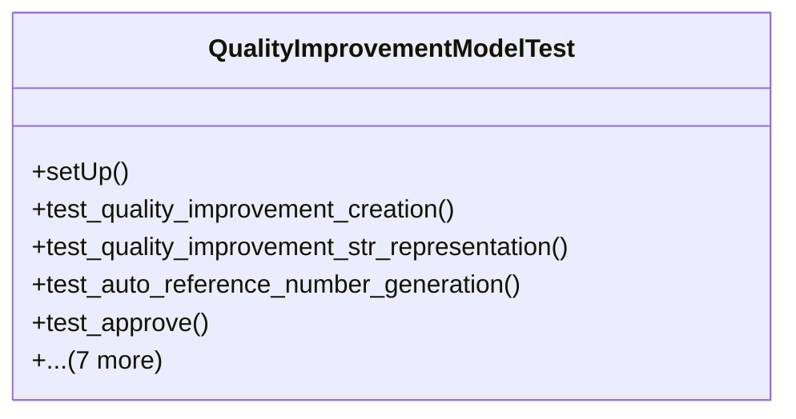

# services_modules.quality_control.tests.test_quality_improvement

## Imports
- django.contrib.auth
- django.test
- django.utils
- models.quality_check
- models.quality_improvement
- models.quality_issue
- models.quality_template

## Classes
- QualityImprovementModelTest
  - method: `setUp`
  - method: `test_quality_improvement_creation`
  - method: `test_quality_improvement_str_representation`
  - method: `test_auto_reference_number_generation`
  - method: `test_approve`
  - method: `test_start`
  - method: `test_complete`
  - method: `test_cancel`
  - method: `test_cannot_cancel_completed_improvement`
  - method: `test_is_overdue`
  - method: `test_get_progress_percentage`
  - method: `test_get_duration`

## Functions
- setUp
- test_quality_improvement_creation
- test_quality_improvement_str_representation
- test_auto_reference_number_generation
- test_approve
- test_start
- test_complete
- test_cancel
- test_cannot_cancel_completed_improvement
- test_is_overdue
- test_get_progress_percentage
- test_get_duration

## Module Variables
- `User`

## Class Diagram

