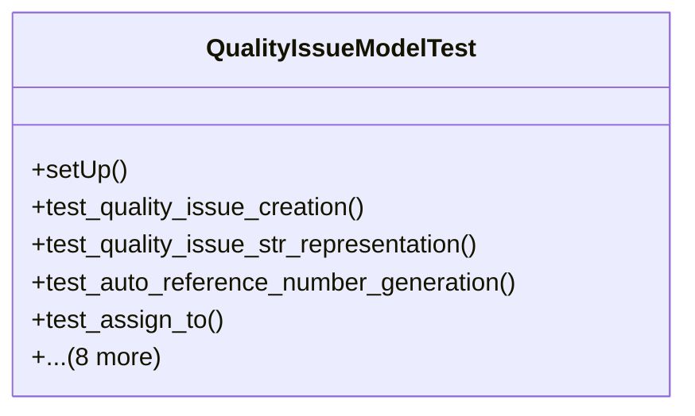

# services_modules.quality_control.tests.test_quality_issue

## Imports
- django.contrib.auth
- django.db
- django.test
- django.utils
- models.quality_check
- models.quality_improvement
- models.quality_issue
- models.quality_template

## Classes
- QualityIssueModelTest
  - method: `setUp`
  - method: `test_quality_issue_creation`
  - method: `test_quality_issue_str_representation`
  - method: `test_auto_reference_number_generation`
  - method: `test_assign_to`
  - method: `test_start_investigation`
  - method: `test_start_resolution`
  - method: `test_resolve`
  - method: `test_close`
  - method: `test_cannot_close_unresolved_issue`
  - method: `test_reopen`
  - method: `test_get_resolution_time`
  - method: `test_create_improvement`

## Functions
- setUp
- test_quality_issue_creation
- test_quality_issue_str_representation
- test_auto_reference_number_generation
- test_assign_to
- test_start_investigation
- test_start_resolution
- test_resolve
- test_close
- test_cannot_close_unresolved_issue
- test_reopen
- test_get_resolution_time
- test_create_improvement

## Module Variables
- `User`

## Class Diagram

