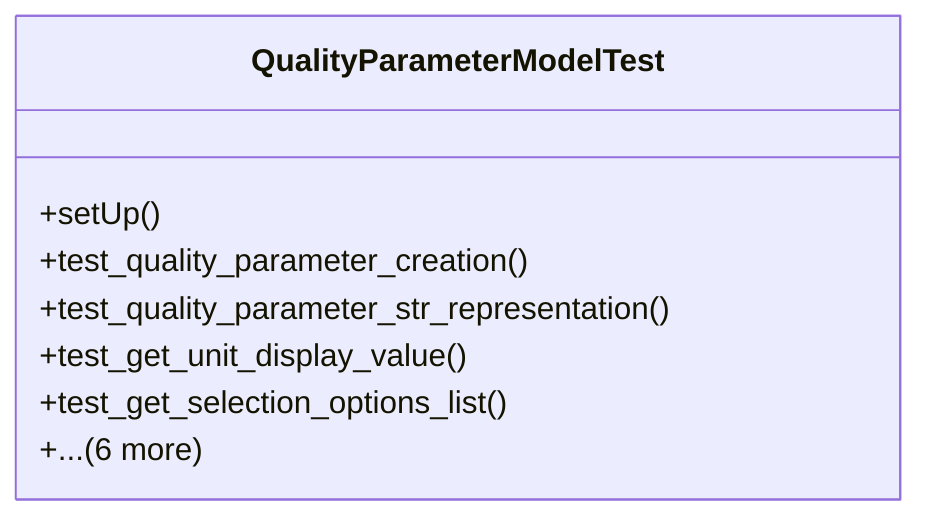

# services_modules.quality_control.tests.test_quality_parameter

## Imports
- django.contrib.auth
- django.core.exceptions
- django.db
- django.test
- models.quality_parameter
- models.quality_template

## Classes
- QualityParameterModelTest
  - method: `setUp`
  - method: `test_quality_parameter_creation`
  - method: `test_quality_parameter_str_representation`
  - method: `test_get_unit_display_value`
  - method: `test_get_selection_options_list`
  - method: `test_is_value_within_range`
  - method: `test_is_valid_selection`
  - method: `test_validation_min_greater_than_max`
  - method: `test_validation_selection_without_options`
  - method: `test_validation_custom_unit_required`
  - method: `test_boolean_parameter_auto_clean`

## Functions
- setUp
- test_quality_parameter_creation
- test_quality_parameter_str_representation
- test_get_unit_display_value
- test_get_selection_options_list
- test_is_value_within_range
- test_is_valid_selection
- test_validation_min_greater_than_max
- test_validation_selection_without_options
- test_validation_custom_unit_required
- test_boolean_parameter_auto_clean

## Module Variables
- `User`

## Class Diagram

