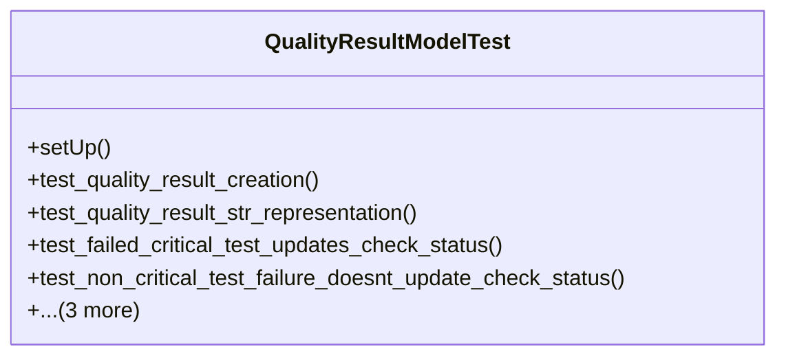

# services_modules.quality_control.tests.test_quality_result

## Imports
- django.contrib.auth
- django.db
- django.test
- django.utils
- models.quality_check
- models.quality_parameter
- models.quality_result
- models.quality_template
- models.quality_test

## Classes
- QualityResultModelTest
  - method: `setUp`
  - method: `test_quality_result_creation`
  - method: `test_quality_result_str_representation`
  - method: `test_failed_critical_test_updates_check_status`
  - method: `test_non_critical_test_failure_doesnt_update_check_status`
  - method: `test_get_deviation`
  - method: `test_get_deviation_percentage`
  - method: `test_get_formatted_value`

## Functions
- setUp
- test_quality_result_creation
- test_quality_result_str_representation
- test_failed_critical_test_updates_check_status
- test_non_critical_test_failure_doesnt_update_check_status
- test_get_deviation
- test_get_deviation_percentage
- test_get_formatted_value

## Module Variables
- `User`

## Class Diagram

