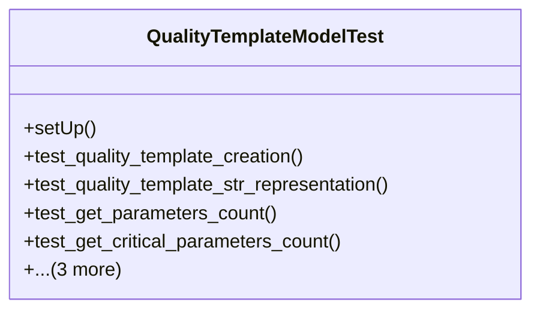

# services_modules.quality_control.tests.test_quality_template

## Imports
- datetime
- django.contrib.auth
- django.core.exceptions
- django.test
- django.utils
- models.quality_parameter
- models.quality_template

## Classes
- QualityTemplateModelTest
  - method: `setUp`
  - method: `test_quality_template_creation`
  - method: `test_quality_template_str_representation`
  - method: `test_get_parameters_count`
  - method: `test_get_critical_parameters_count`
  - method: `test_duplicate_template`
  - method: `test_create_check`
  - method: `test_validation_no_parameters`

## Functions
- setUp
- test_quality_template_creation
- test_quality_template_str_representation
- test_get_parameters_count
- test_get_critical_parameters_count
- test_duplicate_template
- test_create_check
- test_validation_no_parameters

## Module Variables
- `User`

## Class Diagram

