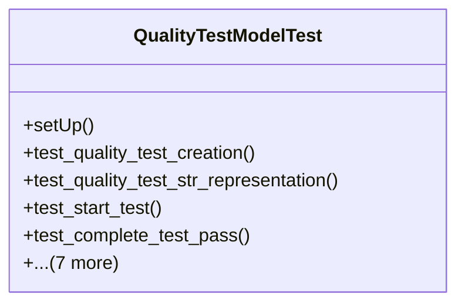

# services_modules.quality_control.tests.test_quality_test

## Imports
- django.contrib.auth
- django.core.exceptions
- django.test
- django.utils
- models.quality_check
- models.quality_parameter
- models.quality_result
- models.quality_template
- models.quality_test

## Classes
- QualityTestModelTest
  - method: `setUp`
  - method: `test_quality_test_creation`
  - method: `test_quality_test_str_representation`
  - method: `test_start_test`
  - method: `test_complete_test_pass`
  - method: `test_complete_test_fail`
  - method: `test_skip_test`
  - method: `test_cannot_skip_completed_test`
  - method: `test_get_duration`
  - method: `test_validation_end_date_before_start_date`
  - method: `test_is_value_acceptable`
  - method: `test_get_latest_result`

## Functions
- setUp
- test_quality_test_creation
- test_quality_test_str_representation
- test_start_test
- test_complete_test_pass
- test_complete_test_fail
- test_skip_test
- test_cannot_skip_completed_test
- test_get_duration
- test_validation_end_date_before_start_date
- test_is_value_acceptable
- test_get_latest_result

## Module Variables
- `User`

## Class Diagram

