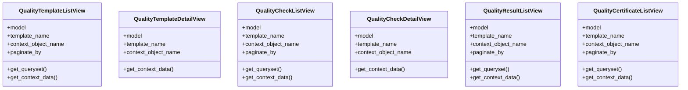

# services_modules.quality_control.views

## Imports
- datetime
- django.contrib
- django.contrib.auth.decorators
- django.core.paginator
- django.db.models
- django.http
- django.shortcuts
- django.urls
- django.utils
- django.utils.decorators
- django.views
- django.views.generic
- models

## Classes
- QualityTemplateListView
  - attr: `model`
  - attr: `template_name`
  - attr: `context_object_name`
  - attr: `paginate_by`
  - method: `get_queryset`
  - method: `get_context_data`
- QualityTemplateDetailView
  - attr: `model`
  - attr: `template_name`
  - attr: `context_object_name`
  - method: `get_context_data`
- QualityCheckListView
  - attr: `model`
  - attr: `template_name`
  - attr: `context_object_name`
  - attr: `paginate_by`
  - method: `get_queryset`
  - method: `get_context_data`
- QualityCheckDetailView
  - attr: `model`
  - attr: `template_name`
  - attr: `context_object_name`
  - method: `get_context_data`
- QualityResultListView
  - attr: `model`
  - attr: `template_name`
  - attr: `context_object_name`
  - attr: `paginate_by`
  - method: `get_queryset`
  - method: `get_context_data`
- QualityCertificateListView
  - attr: `model`
  - attr: `template_name`
  - attr: `context_object_name`
  - attr: `paginate_by`
  - method: `get_queryset`
  - method: `get_context_data`

## Functions
- quality_dashboard
- get_queryset
- get_context_data
- get_context_data
- get_queryset
- get_context_data
- get_context_data
- get_queryset
- get_context_data
- get_queryset
- get_context_data

## Class Diagram

