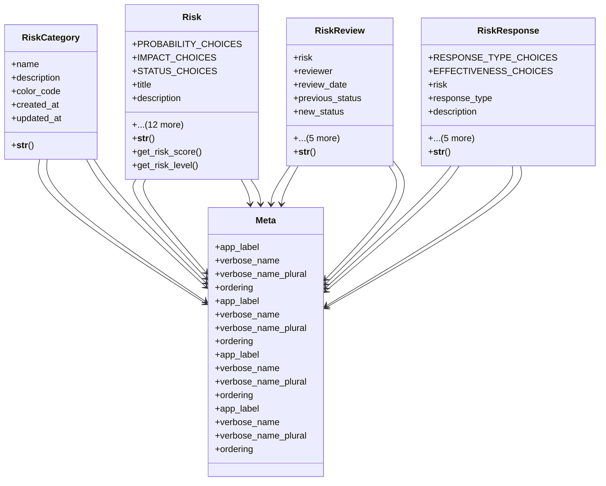

# services_modules.risk_management.models

## Imports
- django.contrib.auth
- django.db
- django.utils.translation

## Classes
- RiskCategory
  - attr: `name`
  - attr: `description`
  - attr: `color_code`
  - attr: `created_at`
  - attr: `updated_at`
  - method: `__str__`
- Risk
  - attr: `PROBABILITY_CHOICES`
  - attr: `IMPACT_CHOICES`
  - attr: `STATUS_CHOICES`
  - attr: `title`
  - attr: `description`
  - attr: `category`
  - attr: `probability`
  - attr: `impact`
  - attr: `status`
  - attr: `mitigation_plan`
  - attr: `contingency_plan`
  - attr: `owner`
  - attr: `identified_date`
  - attr: `resolution_date`
  - attr: `related_project`
  - attr: `created_at`
  - attr: `updated_at`
  - method: `__str__`
  - method: `get_risk_score`
  - method: `get_risk_level`
- RiskReview
  - attr: `risk`
  - attr: `reviewer`
  - attr: `review_date`
  - attr: `previous_status`
  - attr: `new_status`
  - attr: `previous_probability`
  - attr: `new_probability`
  - attr: `previous_impact`
  - attr: `new_impact`
  - attr: `comments`
  - method: `__str__`
- RiskResponse
  - attr: `RESPONSE_TYPE_CHOICES`
  - attr: `EFFECTIVENESS_CHOICES`
  - attr: `risk`
  - attr: `response_type`
  - attr: `description`
  - attr: `action_taken`
  - attr: `responder`
  - attr: `response_date`
  - attr: `effectiveness`
  - attr: `cost`
  - method: `__str__`
- Meta
  - attr: `app_label`
  - attr: `verbose_name`
  - attr: `verbose_name_plural`
  - attr: `ordering`
- Meta
  - attr: `app_label`
  - attr: `verbose_name`
  - attr: `verbose_name_plural`
  - attr: `ordering`
- Meta
  - attr: `app_label`
  - attr: `verbose_name`
  - attr: `verbose_name_plural`
  - attr: `ordering`
- Meta
  - attr: `app_label`
  - attr: `verbose_name`
  - attr: `verbose_name_plural`
  - attr: `ordering`

## Functions
- __str__
- __str__
- get_risk_score
- get_risk_level
- __str__
- __str__

## Module Variables
- `User`

## Class Diagram

