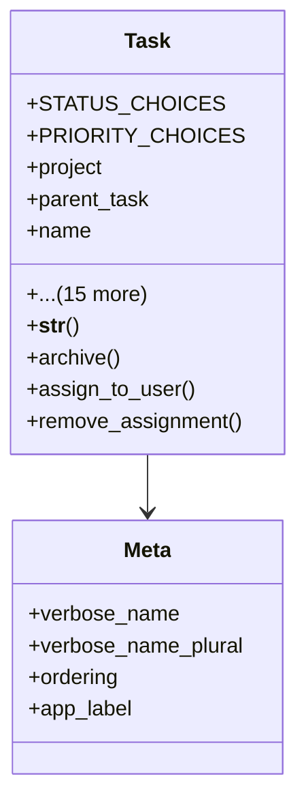

# services_modules.tasks.models.task

## Imports
- django.conf
- django.db
- django.utils.translation

## Classes
- Task
  - attr: `STATUS_CHOICES`
  - attr: `PRIORITY_CHOICES`
  - attr: `project`
  - attr: `parent_task`
  - attr: `name`
  - attr: `description`
  - attr: `status`
  - attr: `priority`
  - attr: `assigned_to`
  - attr: `creator`
  - attr: `tags`
  - attr: `due_date`
  - attr: `start_date`
  - attr: `estimated_effort`
  - attr: `actual_effort`
  - attr: `created_at`
  - attr: `updated_at`
  - attr: `requires_transport`
  - attr: `transport_vehicle`
  - attr: `related_nursery`
  - method: `__str__`
  - method: `archive`
  - method: `assign_to_user`
  - method: `remove_assignment`
- Meta
  - attr: `verbose_name`
  - attr: `verbose_name_plural`
  - attr: `ordering`
  - attr: `app_label`

## Functions
- __str__
- archive
- assign_to_user
- remove_assignment

## Class Diagram

