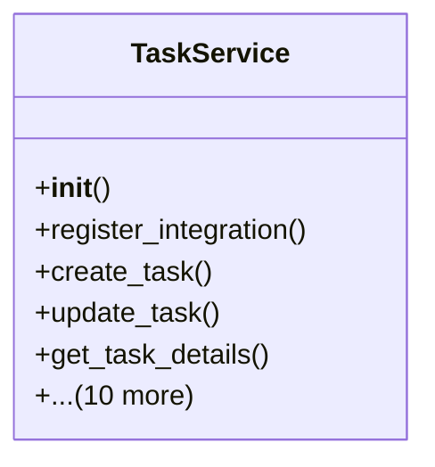

# services_modules.tasks.services

## Imports
- datetime
- django.db
- django.db.models
- django.utils
- logging
- models.tag
- models.task

## Classes
- TaskService
  - method: `__init__`
  - method: `register_integration`
  - method: `create_task`
  - method: `update_task`
  - method: `get_task_details`
  - method: `list_tasks`
  - method: `update_task_status`
  - method: `assign_task`
  - method: `unassign_task`
  - method: `archive_task`
  - method: `create_tag`
  - method: `update_tag`
  - method: `list_tags`
  - method: `get_task_statistics`
  - method: `generate_task_report`

## Functions
- __init__
- register_integration
- create_task
- update_task
- get_task_details
- list_tasks
- update_task_status
- assign_task
- unassign_task
- archive_task
- create_tag
- update_tag
- list_tags
- get_task_statistics
- generate_task_report

## Module Variables
- `logger`

## Class Diagram

