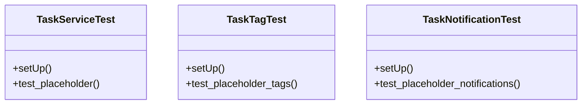

# services_modules.tasks.tests.test_services

## Imports
- datetime
- django.contrib.auth
- django.test
- django.utils
- pytest

## Classes
- TaskServiceTest
  - method: `setUp`
  - method: `test_placeholder`
- TaskTagTest
  - method: `setUp`
  - method: `test_placeholder_tags`
- TaskNotificationTest
  - method: `setUp`
  - method: `test_placeholder_notifications`

## Functions
- setUp
- test_placeholder
- setUp
- test_placeholder_tags
- setUp
- test_placeholder_notifications

## Module Variables
- `User`

## Class Diagram

