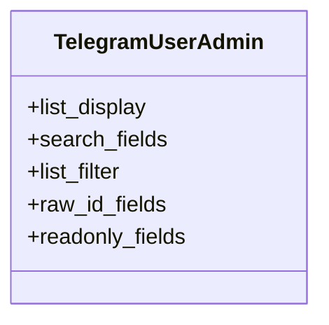

# services_modules.telegram_bot.admin

## Imports
- django.contrib
- models

## Classes
- TelegramUserAdmin
  - attr: `list_display`
  - attr: `search_fields`
  - attr: `list_filter`
  - attr: `raw_id_fields`
  - attr: `readonly_fields`

## Class Diagram

