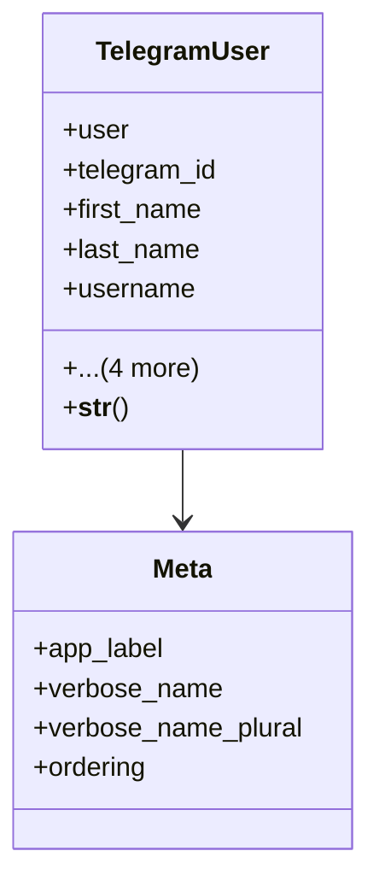

# services_modules.telegram_bot.models

## Imports
- django.conf
- django.db
- django.utils.translation

## Classes
- TelegramUser
  - attr: `user`
  - attr: `telegram_id`
  - attr: `first_name`
  - attr: `last_name`
  - attr: `username`
  - attr: `is_bot_active`
  - attr: `created_at`
  - attr: `updated_at`
  - attr: `app_label`
  - method: `__str__`
- Meta
  - attr: `app_label`
  - attr: `verbose_name`
  - attr: `verbose_name_plural`
  - attr: `ordering`

## Functions
- __str__

## Class Diagram

