# services_modules.training.models

## Imports
- django.contrib.auth
- django.core.validators
- django.db
- django.utils
- django.utils.translation
- uuid

## Classes
- TrainingCategory
  - attr: `name`
  - attr: `description`
  - attr: `is_active`
  - attr: `created_at`
  - attr: `updated_at`
  - method: `__str__`
- Trainer
  - attr: `QUALIFICATION_CHOICES`
  - attr: `user`
  - attr: `employee_id`
  - attr: `specialization`
  - attr: `qualification`
  - attr: `experience_years`
  - attr: `bio`
  - attr: `phone`
  - attr: `email`
  - attr: `hourly_rate`
  - attr: `is_internal`
  - attr: `is_active`
  - attr: `created_at`
  - attr: `updated_at`
  - method: `__str__`
- TrainingProgram
  - attr: `STATUS_CHOICES`
  - attr: `LEVEL_CHOICES`
  - attr: `name`
  - attr: `code`
  - attr: `category`
  - attr: `description`
  - attr: `objectives`
  - attr: `target_audience`
  - attr: `prerequisites`
  - attr: `level`
  - attr: `duration_hours`
  - attr: `max_participants`
  - attr: `cost_per_participant`
  - attr: `status`
  - attr: `is_mandatory`
  - attr: `created_by`
  - attr: `created_at`
  - attr: `updated_at`
  - method: `__str__`
- TrainingCourse
  - attr: `STATUS_CHOICES`
  - attr: `program`
  - attr: `course_number`
  - attr: `trainer`
  - attr: `start_date`
  - attr: `end_date`
  - attr: `location`
  - attr: `room`
  - attr: `max_participants`
  - attr: `enrolled_count`
  - attr: `status`
  - attr: `notes`
  - attr: `created_by`
  - attr: `created_at`
  - attr: `updated_at`
  - method: `__str__`
  - method: `available_seats`
  - method: `is_full`
- Trainee
  - attr: `user`
  - attr: `employee_id`
  - attr: `department`
  - attr: `position`
  - attr: `phone`
  - attr: `email`
  - attr: `manager`
  - attr: `is_active`
  - attr: `created_at`
  - attr: `updated_at`
  - method: `__str__`
- TrainingEnrollment
  - attr: `STATUS_CHOICES`
  - attr: `course`
  - attr: `trainee`
  - attr: `enrollment_date`
  - attr: `status`
  - attr: `approved_by`
  - attr: `approval_date`
  - attr: `completion_date`
  - attr: `final_grade`
  - attr: `certificate_issued`
  - attr: `notes`
  - method: `__str__`
- TrainingSession
  - attr: `course`
  - attr: `session_number`
  - attr: `title`
  - attr: `date`
  - attr: `start_time`
  - attr: `end_time`
  - attr: `topics`
  - attr: `materials`
  - attr: `homework`
  - attr: `notes`
  - attr: `created_at`
  - attr: `updated_at`
  - method: `__str__`
- TrainingAttendance
  - attr: `STATUS_CHOICES`
  - attr: `session`
  - attr: `trainee`
  - attr: `status`
  - attr: `check_in_time`
  - attr: `check_out_time`
  - attr: `notes`
  - attr: `recorded_by`
  - attr: `recorded_at`
  - method: `__str__`
- TrainingEvaluation
  - attr: `EVALUATION_TYPE_CHOICES`
  - attr: `course`
  - attr: `trainee`
  - attr: `evaluation_type`
  - attr: `rating`
  - attr: `feedback`
  - attr: `suggestions`
  - attr: `would_recommend`
  - attr: `submitted_at`
  - method: `__str__`
- TrainingCertificate
  - attr: `enrollment`
  - attr: `certificate_number`
  - attr: `issue_date`
  - attr: `expiry_date`
  - attr: `grade`
  - attr: `is_valid`
  - attr: `issued_by`
  - attr: `template_used`
  - attr: `digital_signature`
  - attr: `verification_code`
  - method: `__str__`
  - method: `save`
- TrainingBudget
  - attr: `year`
  - attr: `department`
  - attr: `allocated_budget`
  - attr: `spent_budget`
  - attr: `notes`
  - attr: `created_by`
  - attr: `created_at`
  - attr: `updated_at`
  - method: `__str__`
  - method: `remaining_budget`
  - method: `budget_utilization_percentage`
- Meta
  - attr: `app_label`
  - attr: `verbose_name`
  - attr: `verbose_name_plural`
  - attr: `ordering`
- Meta
  - attr: `app_label`
  - attr: `verbose_name`
  - attr: `verbose_name_plural`
  - attr: `ordering`
- Meta
  - attr: `app_label`
  - attr: `verbose_name`
  - attr: `verbose_name_plural`
  - attr: `ordering`
- Meta
  - attr: `app_label`
  - attr: `verbose_name`
  - attr: `verbose_name_plural`
  - attr: `ordering`
  - attr: `unique_together`
- Meta
  - attr: `app_label`
  - attr: `verbose_name`
  - attr: `verbose_name_plural`
  - attr: `ordering`
- Meta
  - attr: `app_label`
  - attr: `verbose_name`
  - attr: `verbose_name_plural`
  - attr: `ordering`
  - attr: `unique_together`
- Meta
  - attr: `app_label`
  - attr: `verbose_name`
  - attr: `verbose_name_plural`
  - attr: `ordering`
  - attr: `unique_together`
- Meta
  - attr: `app_label`
  - attr: `verbose_name`
  - attr: `verbose_name_plural`
  - attr: `ordering`
  - attr: `unique_together`
- Meta
  - attr: `app_label`
  - attr: `verbose_name`
  - attr: `verbose_name_plural`
  - attr: `ordering`
  - attr: `unique_together`
- Meta
  - attr: `app_label`
  - attr: `verbose_name`
  - attr: `verbose_name_plural`
  - attr: `ordering`
- Meta
  - attr: `app_label`
  - attr: `verbose_name`
  - attr: `verbose_name_plural`
  - attr: `ordering`
  - attr: `unique_together`

## Functions
- __str__
- __str__
- __str__
- __str__
- available_seats
- is_full
- __str__
- __str__
- __str__
- __str__
- __str__
- __str__
- save
- __str__
- remaining_budget
- budget_utilization_percentage

## Module Variables
- `User`

## Class Diagram

```mermaid
classDiagram
    class TrainingCategory {
        +name
        +description
        +is_active
        +created_at
        +updated_at
        +__str__()
    }
    class Trainer {
        +QUALIFICATION_CHOICES
        +user
        +employee_id
        +specialization
        +qualification
        +... (9 more)
        +__str__()
    }
    class TrainingProgram {
        +STATUS_CHOICES
        +LEVEL_CHOICES
        +name
        +code
        +category
        +... (13 more)
        +__str__()
    }
    class TrainingCourse {
        +STATUS_CHOICES
        +program
        +course_number
        +trainer
        +start_date
        +... (10 more)
        +__str__()
        +available_seats()
        +is_full()
    }
    class Trainee {
        +user
        +employee_id
        +department
        +position
        +phone
        +... (5 more)
        +__str__()
    }
    class TrainingEnrollment {
        +STATUS_CHOICES
        +course
        +trainee
        +enrollment_date
        +status
        +... (6 more)
        +__str__()
    }
    class TrainingSession {
        +course
        +session_number
        +title
        +date
        +start_time
        +... (7 more)
        +__str__()
    }
    class TrainingAttendance {
        +STATUS_CHOICES
        +session
        +trainee
        +status
        +check_in_time
        +... (4 more)
        +__str__()
    }
    class TrainingEvaluation {
        +EVALUATION_TYPE_CHOICES
        +course
        +trainee
        +evaluation_type
        +rating
        +... (4 more)
        +__str__()
    }
    class TrainingCertificate {
        +enrollment
        +certificate_number
        +issue_date
        +expiry_date
        +grade
        +... (5 more)
        +__str__()
        +save()
    }
    class TrainingBudget {
        +year
        +department
        +allocated_budget
        +spent_budget
        +notes
        +... (3 more)
        +__str__()
        +remaining_budget()
        +budget_utilization_percentage()
    }
    class Meta {
        +app_label
        +verbose_name
        +verbose_name_plural
        +ordering
    }
    class Meta {
        +app_label
        +verbose_name
        +verbose_name_plural
        +ordering
    }
    class Meta {
        +app_label
        +verbose_name
        +verbose_name_plural
        +ordering
    }
    class Meta {
        +app_label
        +verbose_name
        +verbose_name_plural
        +ordering
        +unique_together
    }
    class Meta {
        +app_label
        +verbose_name
        +verbose_name_plural
        +ordering
    }
    class Meta {
        +app_label
        +verbose_name
        +verbose_name_plural
        +ordering
        +unique_together
    }
    class Meta {
        +app_label
        +verbose_name
        +verbose_name_plural
        +ordering
        +unique_together
    }
    class Meta {
        +app_label
        +verbose_name
        +verbose_name_plural
        +ordering
        +unique_together
    }
    class Meta {
        +app_label
        +verbose_name
        +verbose_name_plural
        +ordering
        +unique_together
    }
    class Meta {
        +app_label
        +verbose_name
        +verbose_name_plural
        +ordering
    }
    class Meta {
        +app_label
        +verbose_name
        +verbose_name_plural
        +ordering
        +unique_together
    }
    TrainingCategory --> Meta
    TrainingCategory --> Meta
    TrainingCategory --> Meta
    TrainingCategory --> Meta
    TrainingCategory --> Meta
    TrainingCategory --> Meta
    TrainingCategory --> Meta
    TrainingCategory --> Meta
    TrainingCategory --> Meta
    TrainingCategory --> Meta
    TrainingCategory --> Meta
    Trainer --> Meta
    Trainer --> Meta
    Trainer --> Meta
    Trainer --> Meta
    Trainer --> Meta
    Trainer --> Meta
    Trainer --> Meta
    Trainer --> Meta
    Trainer --> Meta
    Trainer --> Meta
    Trainer --> Meta
    TrainingProgram --> Meta
    TrainingProgram --> Meta
    TrainingProgram --> Meta
    TrainingProgram --> Meta
    TrainingProgram --> Meta
    TrainingProgram --> Meta
    TrainingProgram --> Meta
    TrainingProgram --> Meta
    TrainingProgram --> Meta
    TrainingProgram --> Meta
    TrainingProgram --> Meta
    TrainingCourse --> Meta
    TrainingCourse --> Meta
    TrainingCourse --> Meta
    TrainingCourse --> Meta
    TrainingCourse --> Meta
    TrainingCourse --> Meta
    TrainingCourse --> Meta
    TrainingCourse --> Meta
    TrainingCourse --> Meta
    TrainingCourse --> Meta
    TrainingCourse --> Meta
    Trainee --> Meta
    Trainee --> Meta
    Trainee --> Meta
    Trainee --> Meta
    Trainee --> Meta
    Trainee --> Meta
    Trainee --> Meta
    Trainee --> Meta
    Trainee --> Meta
    Trainee --> Meta
    Trainee --> Meta
    TrainingEnrollment --> Meta
    TrainingEnrollment --> Meta
    TrainingEnrollment --> Meta
    TrainingEnrollment --> Meta
    TrainingEnrollment --> Meta
    TrainingEnrollment --> Meta
    TrainingEnrollment --> Meta
    TrainingEnrollment --> Meta
    TrainingEnrollment --> Meta
    TrainingEnrollment --> Meta
    TrainingEnrollment --> Meta
    TrainingSession --> Meta
    TrainingSession --> Meta
    TrainingSession --> Meta
    TrainingSession --> Meta
    TrainingSession --> Meta
    TrainingSession --> Meta
    TrainingSession --> Meta
    TrainingSession --> Meta
    TrainingSession --> Meta
    TrainingSession --> Meta
    TrainingSession --> Meta
    TrainingAttendance --> Meta
    TrainingAttendance --> Meta
    TrainingAttendance --> Meta
    TrainingAttendance --> Meta
    TrainingAttendance --> Meta
    TrainingAttendance --> Meta
    TrainingAttendance --> Meta
    TrainingAttendance --> Meta
    TrainingAttendance --> Meta
    TrainingAttendance --> Meta
    TrainingAttendance --> Meta
    TrainingEvaluation --> Meta
    TrainingEvaluation --> Meta
    TrainingEvaluation --> Meta
    TrainingEvaluation --> Meta
    TrainingEvaluation --> Meta
    TrainingEvaluation --> Meta
    TrainingEvaluation --> Meta
    TrainingEvaluation --> Meta
    TrainingEvaluation --> Meta
    TrainingEvaluation --> Meta
    TrainingEvaluation --> Meta
    TrainingCertificate --> Meta
    TrainingCertificate --> Meta
    TrainingCertificate --> Meta
    TrainingCertificate --> Meta
    TrainingCertificate --> Meta
    TrainingCertificate --> Meta
    TrainingCertificate --> Meta
    TrainingCertificate --> Meta
    TrainingCertificate --> Meta
    TrainingCertificate --> Meta
    TrainingCertificate --> Meta
    TrainingBudget --> Meta
    TrainingBudget --> Meta
    TrainingBudget --> Meta
    TrainingBudget --> Meta
    TrainingBudget --> Meta
    TrainingBudget --> Meta
    TrainingBudget --> Meta
    TrainingBudget --> Meta
    TrainingBudget --> Meta
    TrainingBudget --> Meta
    TrainingBudget --> Meta
```

