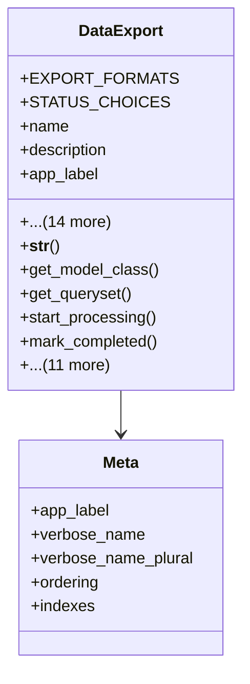

# services_modules.utilities.models.data_export

## Imports
- datetime
- django.apps
- django.conf
- django.db
- django.utils
- django.utils.translation
- os

## Classes
- DataExport
  - attr: `EXPORT_FORMATS`
  - attr: `STATUS_CHOICES`
  - attr: `name`
  - attr: `description`
  - attr: `app_label`
  - attr: `model_name`
  - attr: `format`
  - attr: `query_params`
  - attr: `status`
  - attr: `progress`
  - attr: `file_path`
  - attr: `file_size`
  - attr: `user`
  - attr: `created_at`
  - attr: `started_at`
  - attr: `completed_at`
  - attr: `error_message`
  - attr: `is_scheduled`
  - attr: `schedule_time`
  - method: `__str__`
  - method: `get_model_class`
  - method: `get_queryset`
  - method: `start_processing`
  - method: `mark_completed`
  - method: `mark_failed`
  - method: `cancel`
  - method: `update_progress`
  - method: `is_completed`
  - method: `is_failed`
  - method: `is_processing`
  - method: `duration`
  - method: `file_exists`
  - method: `delete_file`
  - method: `cleanup_old_exports`
  - method: `get_user_exports`
- Meta
  - attr: `app_label`
  - attr: `verbose_name`
  - attr: `verbose_name_plural`
  - attr: `ordering`
  - attr: `indexes`

## Functions
- __str__
- get_model_class
- get_queryset
- start_processing
- mark_completed
- mark_failed
- cancel
- update_progress
- is_completed
- is_failed
- is_processing
- duration
- file_exists
- delete_file
- cleanup_old_exports
- get_user_exports

## Class Diagram

