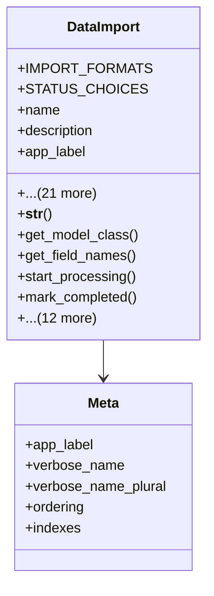

# services_modules.utilities.models.data_import

## Imports
- datetime
- django.apps
- django.conf
- django.db
- django.utils
- django.utils.translation
- os

## Classes
- DataImport
  - attr: `IMPORT_FORMATS`
  - attr: `STATUS_CHOICES`
  - attr: `name`
  - attr: `description`
  - attr: `app_label`
  - attr: `model_name`
  - attr: `format`
  - attr: `file_path`
  - attr: `has_header`
  - attr: `delimiter`
  - attr: `encoding`
  - attr: `field_mapping`
  - attr: `status`
  - attr: `progress`
  - attr: `total_rows`
  - attr: `processed_rows`
  - attr: `successful_rows`
  - attr: `failed_rows`
  - attr: `user`
  - attr: `created_at`
  - attr: `started_at`
  - attr: `completed_at`
  - attr: `error_message`
  - attr: `error_log`
  - attr: `validate_data`
  - attr: `skip_errors`
  - method: `__str__`
  - method: `get_model_class`
  - method: `get_field_names`
  - method: `start_processing`
  - method: `mark_completed`
  - method: `mark_failed`
  - method: `cancel`
  - method: `update_progress`
  - method: `add_error`
  - method: `is_completed`
  - method: `is_failed`
  - method: `is_processing`
  - method: `success_rate`
  - method: `duration`
  - method: `file_exists`
  - method: `get_user_imports`
  - method: `cleanup_old_imports`
- Meta
  - attr: `app_label`
  - attr: `verbose_name`
  - attr: `verbose_name_plural`
  - attr: `ordering`
  - attr: `indexes`

## Functions
- __str__
- get_model_class
- get_field_names
- start_processing
- mark_completed
- mark_failed
- cancel
- update_progress
- add_error
- is_completed
- is_failed
- is_processing
- success_rate
- duration
- file_exists
- get_user_imports
- cleanup_old_imports

## Class Diagram

