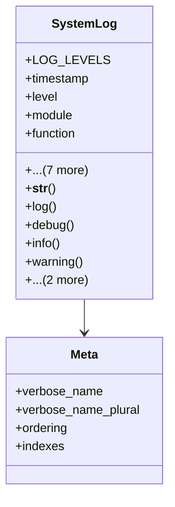

# services_modules.utilities.models.system_log

## Imports
- django.conf
- django.db
- django.utils.translation

## Classes
- SystemLog
  - attr: `LOG_LEVELS`
  - attr: `timestamp`
  - attr: `level`
  - attr: `module`
  - attr: `function`
  - attr: `message`
  - attr: `details`
  - attr: `user`
  - attr: `ip_address`
  - attr: `user_agent`
  - attr: `request_path`
  - attr: `request_method`
  - method: `__str__`
  - method: `log`
  - method: `debug`
  - method: `info`
  - method: `warning`
  - method: `error`
  - method: `critical`
- Meta
  - attr: `verbose_name`
  - attr: `verbose_name_plural`
  - attr: `ordering`
  - attr: `indexes`

## Functions
- __str__
- log
- debug
- info
- warning
- error
- critical

## Class Diagram

