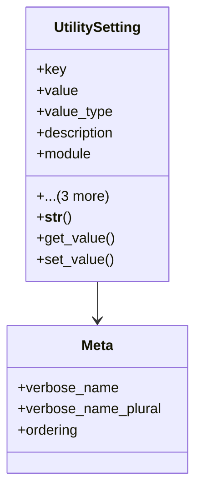

# services_modules.utilities.models.utility_setting

## Imports
- django.db
- django.utils.translation
- json

## Classes
- UtilitySetting
  - attr: `key`
  - attr: `value`
  - attr: `value_type`
  - attr: `description`
  - attr: `module`
  - attr: `is_system`
  - attr: `created_at`
  - attr: `updated_at`
  - method: `__str__`
  - method: `get_value`
  - method: `set_value`
- Meta
  - attr: `verbose_name`
  - attr: `verbose_name_plural`
  - attr: `ordering`

## Functions
- __str__
- get_value
- set_value

## Class Diagram

