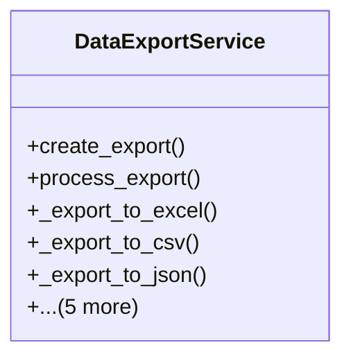

# services_modules.utilities.services.data_export_service

## Imports
- datetime
- django.apps
- django.conf
- django.core.exceptions
- django.core.serializers.json
- django.db
- django.utils
- json
- models.data_export
- os
- pandas

## Classes
- DataExportService
  - method: `create_export`
  - method: `process_export`
  - method: `_export_to_excel`
  - method: `_export_to_csv`
  - method: `_export_to_json`
  - method: `get_export_status`
  - method: `cancel_export`
  - method: `delete_export`
  - method: `get_user_exports`
  - method: `cleanup_old_exports`

## Functions
- create_export
- process_export
- _export_to_excel
- _export_to_csv
- _export_to_json
- get_export_status
- cancel_export
- delete_export
- get_user_exports
- cleanup_old_exports

## Class Diagram

