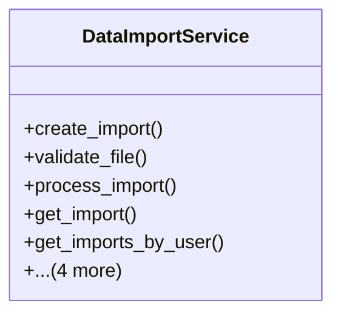

# services_modules.utilities.services.data_import_service

## Imports
- django.utils
- models.data_import

## Classes
- DataImportService
  - method: `create_import`
  - method: `validate_file`
  - method: `process_import`
  - method: `get_import`
  - method: `get_imports_by_user`
  - method: `get_recent_imports`
  - method: `delete_import`
  - method: `clear_old_imports`
  - method: `get_import_status`

## Functions
- create_import
- validate_file
- process_import
- get_import
- get_imports_by_user
- get_recent_imports
- delete_import
- clear_old_imports
- get_import_status

## Class Diagram

